# Polyglot Codebase Knowledge Graph

> Generated offline by **readmenator**. 4 files, 366 symbols, 10 imports. Supports C, C++, Python, Go, Rust, JS/TS, Java, C#, Shell, PHP, Dart, GDScript, Nim, ASM, Ruby, Swift, Kotlin, Scala, Lua, Elixir.
> No LLMs. No tokens. Pure static analysis. See more [here](https://github.com/grisuno/ReadMenator)

**Start here:** Statistics Dashboard for scope, God Nodes for blast radius, Architecture Reference for per-file API. Agents: prefer `readmenator-agent/INDEX.md` + `SYMBOLS.md`.

**Wiki:** prefer `readmenator-wiki/index.md` for progressive disclosure: one synthesis page per community, `connections.json` with EXTRACTED vs INFERRED confidence, `queries.md` log, `REPORT.md` audit.

**Confidence:** EXTRACTED = parsed from source, INFERRED = heuristic bridge, AMBIGUOUS = reported, never hidden. See `readmenator-wiki/REPORT.md`.

**Total Files Parsed:** 4 | **Total Symbols Extracted:** 366 | **Total Imports:** 10
 | **Resolved Imports:** 1

<!-- ranking_model: v1.0 | weights: {ppr:0.45,auth:0.2,test:0.15,doc:0.1,fresh:0.1} | alpha:0.85 | commit:1e0fd0b | date:2026-07-18 -->


## Table of Contents

1. [Statistics Dashboard](#statistics-dashboard)
2. [Architectural Layers](#architectural-layers)
3. [Ranked Context](#ranked-context)
4. [God Nodes](#god-nodes)
5. [Community Analysis](#community-analysis)
6. [Suggested Questions](#suggested-questions)
7. [Hotspot Analysis](#hotspot-analysis)
8. [Change Impact Analysis](#change-impact-analysis)
9. [Suggested Linting Rules](#suggested-linting-rules)
10. [Concept Graph](#concept-graph)
11. [Orphans](#orphans)
12. [Query Recipes](#query-recipes)
13. [Structural Knowledge Map](#structural-knowledge-map)
14. [UML Class Diagram](#uml-class-diagram)
15. [Code Property Graph](#code-property-graph)
16. [Architecture Reference](#architecture-reference)
    - [C (1 files)](#c-1-files)
    - [H (1 files)](#h-1-files)
    - [PY (1 files)](#py-1-files)
    - [SH (1 files)](#sh-1-files)

---

## Statistics Dashboard

| Metric | Value |
|--------|-------|
| Total Files | 4 |
| Total Symbols | 366 |
| Total Imports | 10 |
| Call Edges | 0 |
| Inheritance Edges | 0 |
| Languages | 4 |
| Avg Symbols/File | 91.5 |
| Avg Imports/File | 2.5 |
| Resolved Imports | 1 |

### Top Files by Import Count (Fan-Out)

| File | Imports | Symbols | Language |
|------|---------|---------|----------|
| `minicraft.c` | 9 | 237 | c |
| `app.py` | 1 | 0 | py |

### Top Files by Imported-By Count (Fan-In)

| File | Imported By | Symbols | Language |
|------|-------------|---------|----------|
| `minios_abi.h` | 1 | 129 | h |

---

## Architectural Layers

Auto-detected from path patterns, naming conventions, and imported frameworks.

| Layer | Files |
|-------|-------|
| utility | 4 |

### utility

- `app.py` (py, 0 symbols)
- `install.sh` (sh, 0 symbols)
- `minicraft.c` (c, 237 symbols)
- `minios_abi.h` (h, 129 symbols)

---

## Ranked Context

Files ranked by composite score for the current query context. The ranking combines Personalized PageRank (query relevance), global authority, test coverage, documentation coverage, and code freshness. Model: v1.0.

| Rank | File | Composite | PPR | Authority | Test | Doc |
|------|------|-----------|-----|-----------|------|-----|
| 1 | `minios_abi.h` | 0.4227 | 0.6491 | 0.6491 | 0.00 | 0.01 |
| 2 | `minicraft.c` | 0.2352 | 0.3509 | 0.3509 | 0.00 | 0.07 |
| 3 | `app.py` | 0.1000 | 0.0000 | 0.0000 | 0.00 | 1.00 |
| 4 | `install.sh` | 0.0000 | 0.0000 | 0.0000 | 0.00 | 0.00 |

---

## God Nodes

Most architecturally central files ranked by combined import/export degree and symbol richness.

| File | Score | Connections | PageRank |
|------|-------|-------------|----------|
| `minicraft.c` | 25.7 | | 0.3509 |
| `minios_abi.h` | 14.9 | | 0.6491 |
| `app.py` | 0.0 | | 0.0000 |
| `install.sh` | 0.0 | | 0.0000 |

---

## Community Analysis

Files grouped by import-based community detection. Cohesion measures how tightly connected each community is internally.

### root (Cohesion: 1.00)

**2 files** in this community:

- `minicraft.c` (c, 237 symbols)
- `minios_abi.h` (h, 129 symbols)

---

## Suggested Questions

Auto-generated exploration prompts based on graph structure:

- What does minicraft.c depend on, and what depends on it? (1 connections)
- What does minios_abi.h depend on, and what depends on it? (1 connections)
- What does app.py depend on, and what depends on it? (0 connections)
- What is Recipe in minicraft.c and how is it used?
- What is the overall architecture of this codebase?

---

## Hotspot Analysis

Files ranked by combined complexity (symbol count) and centrality (connection count). High-scoring files are architecturally critical and may need refactoring attention.

| File | Complexity | Centrality | Combined | Symbols | Connections |
|------|-----------|------------|----------|---------|-------------|
| `minios_abi.h` | 0.544 | 0.200 | 0.338 | 129 | 2 |
| `minicraft.c` | 1.000 | 1.000 | 1.000 | 237 | 10 |
| `app.py` | 0.000 | 0.100 | 0.060 | 0 | 1 |
| `install.sh` | 0.000 | 0.000 | 0.000 | 0 | 0 |

---

## Concept Graph

Semantic second-brain layer: nouns are concept nodes, verbs are edges. Each noun maps atomically to a file set (EXTRACTED); each verb aggregates structural imports, calls, and inherits into consumes, invokes, extends, depends_on, or bridges (INFERRED).

**30 concepts, 100 relations.**

| Concept | Files | Mentions |
|---------|-------|----------|
| `sys` | 2 | 107 |
| `load` | 2 | 11 |
| `max` | 2 | 11 |
| `raw` | 2 | 10 |
| `kbd` | 2 | 8 |
| `pcspk` | 2 | 7 |
| `set` | 2 | 7 |
| `spawn` | 2 | 5 |
| `time` | 2 | 5 |
| `backbuf` | 2 | 4 |
| `frame` | 2 | 4 |
| `open` | 2 | 4 |
| `title` | 2 | 4 |
| `dir` | 2 | 3 |
| `getc` | 2 | 3 |
| `mouse` | 2 | 3 |
| `palette` | 2 | 3 |
| `poll` | 2 | 3 |
| `present` | 2 | 3 |
| `version` | 2 | 3 |
| `window` | 2 | 3 |
| `zoom` | 2 | 3 |
| `height` | 2 | 2 |
| `kernel` | 2 | 2 |
| `mini` | 2 | 2 |
| `mode` | 2 | 2 |
| `read` | 2 | 2 |
| `top` | 2 | 2 |
| `vga` | 2 | 2 |
| `yield` | 2 | 2 |

### Verb Edges

| Source | Verb | Target | Strength | Evidence |
|--------|------|--------|----------|----------|
| `backbuf` | `consumes` | `dir` | 1.00 | 1 |
| `backbuf` | `depends_on` | `dir` | 1.00 | 1 |
| `backbuf` | `consumes` | `frame` | 1.00 | 1 |
| `backbuf` | `depends_on` | `frame` | 1.00 | 1 |
| `backbuf` | `consumes` | `getc` | 1.00 | 1 |
| `backbuf` | `depends_on` | `getc` | 1.00 | 1 |
| `backbuf` | `consumes` | `height` | 1.00 | 1 |
| `backbuf` | `depends_on` | `height` | 1.00 | 1 |
| `backbuf` | `consumes` | `kbd` | 1.00 | 1 |
| `backbuf` | `depends_on` | `kbd` | 1.00 | 1 |
| `backbuf` | `consumes` | `kernel` | 1.00 | 1 |
| `backbuf` | `depends_on` | `kernel` | 1.00 | 1 |
| `backbuf` | `consumes` | `load` | 1.00 | 1 |
| `backbuf` | `depends_on` | `load` | 1.00 | 1 |
| `backbuf` | `consumes` | `max` | 1.00 | 1 |
| `backbuf` | `depends_on` | `max` | 1.00 | 1 |
| `backbuf` | `consumes` | `mini` | 1.00 | 1 |
| `backbuf` | `depends_on` | `mini` | 1.00 | 1 |
| `backbuf` | `consumes` | `mode` | 1.00 | 1 |
| `backbuf` | `depends_on` | `mode` | 1.00 | 1 |
| `backbuf` | `consumes` | `mouse` | 1.00 | 1 |
| `backbuf` | `depends_on` | `mouse` | 1.00 | 1 |
| `backbuf` | `consumes` | `open` | 1.00 | 1 |
| `backbuf` | `depends_on` | `open` | 1.00 | 1 |
| `backbuf` | `consumes` | `palette` | 1.00 | 1 |
| `backbuf` | `depends_on` | `palette` | 1.00 | 1 |
| `backbuf` | `consumes` | `pcspk` | 1.00 | 1 |
| `backbuf` | `depends_on` | `pcspk` | 1.00 | 1 |
| `backbuf` | `consumes` | `poll` | 1.00 | 1 |
| `backbuf` | `depends_on` | `poll` | 1.00 | 1 |

### Dialectic Prompts

- Thesis: `backbuf` centralizes 2 files; Antithesis: `dir` pulls 2 files with 2 shared (Jaccard 1.00); Synthesis: should they merge, split by layer, or keep `consumes` explicit?
- Thesis: `backbuf` centralizes 2 files; Antithesis: `frame` pulls 2 files with 2 shared (Jaccard 1.00); Synthesis: should they merge, split by layer, or keep `consumes` explicit?
- Thesis: `backbuf` centralizes 2 files; Antithesis: `getc` pulls 2 files with 2 shared (Jaccard 1.00); Synthesis: should they merge, split by layer, or keep `consumes` explicit?
- Thesis: `backbuf` centralizes 2 files; Antithesis: `height` pulls 2 files with 2 shared (Jaccard 1.00); Synthesis: should they merge, split by layer, or keep `consumes` explicit?
- Thesis: `backbuf` centralizes 2 files; Antithesis: `kbd` pulls 2 files with 2 shared (Jaccard 1.00); Synthesis: should they merge, split by layer, or keep `consumes` explicit?
- Thesis: `backbuf` centralizes 2 files; Antithesis: `kernel` pulls 2 files with 2 shared (Jaccard 1.00); Synthesis: should they merge, split by layer, or keep `consumes` explicit?
- Thesis: `backbuf` centralizes 2 files; Antithesis: `load` pulls 2 files with 2 shared (Jaccard 1.00); Synthesis: should they merge, split by layer, or keep `consumes` explicit?
- Thesis: `backbuf` centralizes 2 files; Antithesis: `max` pulls 2 files with 2 shared (Jaccard 1.00); Synthesis: should they merge, split by layer, or keep `consumes` explicit?
- Thesis: `backbuf` centralizes 2 files; Antithesis: `mini` pulls 2 files with 2 shared (Jaccard 1.00); Synthesis: should they merge, split by layer, or keep `consumes` explicit?
- Thesis: `backbuf` centralizes 2 files; Antithesis: `mode` pulls 2 files with 2 shared (Jaccard 1.00); Synthesis: should they merge, split by layer, or keep `consumes` explicit?

---

## Change Impact Analysis

Files sorted by how many other files would be affected if they changed. High-impact files should be changed with caution.

| File | Direct Dependents | Transitive Dependents | Total Impact |
|------|------------------|----------------------|--------------|
| `minios_abi.h` | 1 | 0 | 1 |
| `app.py` | 0 | 0 | 0 |
| `install.sh` | 0 | 0 | 0 |
| `minicraft.c` | 0 | 0 | 0 |

---

## Suggested Linting Rules

Automatically suggested linting and security rules based on patterns detected in the codebase. These can be exported as Semgrep rules using the `--export-rules` flag.

| Rule ID | Severity | Description | Language | Matches |
|---------|----------|-------------|----------|---------|
| `RM001` | info | Large number of functions in c: 124 total | c | 124 |

---

## Orphans

Files with no documentation or low connectivity. These are candidates for documentation investment or cleanup.

- `install.sh` (0 symbols, no doc)

---

## Query Recipes

Example queries you can run against this knowledge base using the ranking engine:

```
# Find files most relevant to a concept
readmenator query "Where is the import resolver implemented?"

# Rank files by relevance to a topic
readmenator query "How does documentation generation work?"

# Explain why a file ranks highly
readmenator query "explain readmenator/_documentation.py"

# Trace dependency paths with ranked context
readmenator query "path from CLI to exporter"
```

The ranking model uses the following signals:

- **Personalized PageRank** (45% weight): query-specific relevance via seed propagation
- **Global Authority** (20% weight): structural importance via standard PageRank
- **Test Coverage** (15% weight): fraction of symbols referenced in test files
- **Doc Coverage** (10% weight): presence of docstrings and file-level docs
- **Freshness** (10% weight): recent modification activity

Results include score decomposition and justification paths for each ranked item.

---

## Structural Knowledge Map

```mermaid
graph TD
    classDef mod fill:#1e1e1e,stroke:#ff6666,stroke-width:2px,color:#fff;
    classDef cls fill:#2d2d2d,stroke:#4ec9b0,stroke-width:2px,color:#fff;
    classDef fn fill:#333,stroke:#dcdcaa,stroke-width:1px,color:#dcdcaa;
    classDef ext fill:#111,stroke:#666,stroke-dasharray:5 5,color:#aaa;
    subgraph community_0 ["root"]
    minicraft_c["minicraft.c (c)"]
    class minicraft_c mod;
    minicraft_c_Recipe["Recipe"]
    class minicraft_c_Recipe cls;
    minicraft_c --> minicraft_c_Recipe
    minicraft_c_Pig["Pig"]
    class minicraft_c_Pig cls;
    minicraft_c --> minicraft_c_Pig
    minicraft_c_RayHit["RayHit"]
    class minicraft_c_RayHit cls;
    minicraft_c --> minicraft_c_RayHit
    minicraft_c_SaveHeaderV3["SaveHeaderV3"]
    class minicraft_c_SaveHeaderV3 cls;
    minicraft_c --> minicraft_c_SaveHeaderV3
    minicraft_c_SaveHeader["SaveHeader"]
    class minicraft_c_SaveHeader cls;
    minicraft_c --> minicraft_c_SaveHeader
    app_py["app.py (py)"]
    class app_py mod;
    minios_abi_h["minios_abi.h (h)"]
    class minios_abi_h mod;
    install_sh["install.sh (sh)"]
    class install_sh mod;
    end
    minicraft_c -- resolved_imports --> minios_abi_h
    ext_os["os"]
    class ext_os ext;
    app_py -.->|imports| ext_os
    ext_stdint_h["stdint.h"]
    class ext_stdint_h ext;
    minicraft_c -.->|imports| ext_stdint_h
    ext_stdio_h["stdio.h"]
    class ext_stdio_h ext;
    minicraft_c -.->|imports| ext_stdio_h
    ext_stdlib_h["stdlib.h"]
    class ext_stdlib_h ext;
    minicraft_c -.->|imports| ext_stdlib_h
    ext_string_h["string.h"]
    class ext_string_h ext;
    minicraft_c -.->|imports| ext_string_h
    ext_unistd_h["unistd.h"]
    class ext_unistd_h ext;
    minicraft_c -.->|imports| ext_unistd_h
    ext_math_h["math.h"]
    class ext_math_h ext;
    minicraft_c -.->|imports| ext_math_h
    ext_minios_abi_h["minios_abi.h"]
    class ext_minios_abi_h ext;
    minicraft_c -.->|imports| ext_minios_abi_h
    ext_SDL2_SDL_h["SDL.h"]
    class ext_SDL2_SDL_h ext;
    minicraft_c -.->|imports| ext_SDL2_SDL_h
    ext_sys_stat_h["stat.h"]
    class ext_sys_stat_h ext;
    minicraft_c -.->|imports| ext_sys_stat_h
```



---

## UML Class Diagram

Auto-generated Mermaid class diagram from parsed class-level symbols. Shows classes, structs, interfaces, traits, and their methods with inheritance and dependency relationships.

```mermaid
classDiagram
  class minicraft_c_Recipe {
    <<struct>>
    +best_tool_for(unsigned char b)
    +break_time_ms(unsigned char b, int tool)
    +break_beep_for(unsigned char b)
    +mc_toggle_zoom(void)
    +sdl_poll_events(void)
    +s_time_ms(void)
    +s_kbd(void)
    +s_kbd_raw(long on)
    +s_getc_raw(void)
    +ser_get(void)
  }
  class minicraft_c_Pig {
    <<struct>>
    +best_tool_for(unsigned char b)
    +break_time_ms(unsigned char b, int tool)
    +break_beep_for(unsigned char b)
    +mc_toggle_zoom(void)
    +sdl_poll_events(void)
    +s_time_ms(void)
    +s_kbd(void)
    +s_kbd_raw(long on)
    +s_getc_raw(void)
    +ser_get(void)
  }
  class minicraft_c_RayHit {
    <<struct>>
    +best_tool_for(unsigned char b)
    +break_time_ms(unsigned char b, int tool)
    +break_beep_for(unsigned char b)
    +mc_toggle_zoom(void)
    +sdl_poll_events(void)
    +s_time_ms(void)
    +s_kbd(void)
    +s_kbd_raw(long on)
    +s_getc_raw(void)
    +ser_get(void)
  }
  class minicraft_c_SaveHeaderV3 {
    <<struct>>
    +best_tool_for(unsigned char b)
    +break_time_ms(unsigned char b, int tool)
    +break_beep_for(unsigned char b)
    +mc_toggle_zoom(void)
    +sdl_poll_events(void)
    +s_time_ms(void)
    +s_kbd(void)
    +s_kbd_raw(long on)
    +s_getc_raw(void)
    +ser_get(void)
  }
  class minicraft_c_SaveHeader {
    <<struct>>
    +best_tool_for(unsigned char b)
    +break_time_ms(unsigned char b, int tool)
    +break_beep_for(unsigned char b)
    +mc_toggle_zoom(void)
    +sdl_poll_events(void)
    +s_time_ms(void)
    +s_kbd(void)
    +s_kbd_raw(long on)
    +s_getc_raw(void)
    +ser_get(void)
  }
  class minicraft_c_ChunkHeader {
    <<struct>>
    +best_tool_for(unsigned char b)
    +break_time_ms(unsigned char b, int tool)
    +break_beep_for(unsigned char b)
    +mc_toggle_zoom(void)
    +sdl_poll_events(void)
    +s_time_ms(void)
    +s_kbd(void)
    +s_kbd_raw(long on)
    +s_getc_raw(void)
    +ser_get(void)
  }
```



---

## Code Property Graph

Machine-readable Code Property Graph (CPG) in JSON-LD format. This block allows AI agents to parse the full structural graph without additional file reads. Compatible with GraphRAG pipelines.

```json
{"@context": "https://schema.org", "analysis": {"communities": [{"cohesion": 1.0, "id": 0, "label": "root", "size": 2}], "god_nodes": [{"node_id": "minicraft.c", "score": 25.7}, {"node_id": "minios_abi.h", "score": 14.9}, {"node_id": "app.py", "score": 0.0}, {"node_id": "install.sh", "score": 0.0}], "surprising_connections": []}, "edges": [{"confidence": "EXTRACTED", "relation": "imports", "source": "app.py", "target": "os"}, {"confidence": "EXTRACTED", "relation": "imports", "source": "minicraft.c", "target": "stdint.h"}, {"confidence": "EXTRACTED", "relation": "imports", "source": "minicraft.c", "target": "stdio.h"}, {"confidence": "EXTRACTED", "relation": "imports", "source": "minicraft.c", "target": "stdlib.h"}, {"confidence": "EXTRACTED", "relation": "imports", "source": "minicraft.c", "target": "string.h"}, {"confidence": "EXTRACTED", "relation": "imports", "source": "minicraft.c", "target": "unistd.h"}, {"confidence": "EXTRACTED", "relation": "imports", "source": "minicraft.c", "target": "math.h"}, {"confidence": "EXTRACTED", "relation": "imports", "source": "minicraft.c", "target": "minios_abi.h"}, {"confidence": "EXTRACTED", "relation": "imports", "source": "minicraft.c", "target": "SDL2/SDL.h"}, {"confidence": "EXTRACTED", "relation": "imports", "source": "minicraft.c", "target": "sys/stat.h"}, {"confidence": "EXTRACTED", "relation": "resolved_imports", "source": "minicraft.c", "target": "minios_abi.h"}], "generator": "readmenator", "metadata": {"edge_count": 11, "file_count": 4, "language_count": 4, "symbol_count": 366}, "nodes": [{"doc": "app.py  Autor: Gris Iscomeback Correo electrónico: grisiscomeback[at]gmail[dot]com Fecha de creación: xx/xx/xxxx Licencia: GPL v3  Descripción:", "id": "app.py", "kind": "module", "label": "app.py", "language": "py", "sha256": "57b21bdb023585b8", "symbol_count": 0, "symbols": []}, {"id": "install.sh", "kind": "module", "label": "install.sh", "language": "sh", "sha256": "c907d80fd6734993", "symbol_count": 0, "symbols": []}, {"doc": "minicraft.c - Minecraft-like voxel walker for MiniOS (ring 3, static ELF).", "id": "minicraft.c", "kind": "module", "label": "minicraft.c", "language": "c", "sha256": "8dd77eb5f1d90a17", "symbol_count": 237, "symbols": [{"kind": "struct", "line": 215, "name": "Recipe"}, {"kind": "struct", "line": 294, "name": "Pig"}, {"kind": "struct", "line": 1706, "name": "RayHit"}, {"doc": "snprintf(last_act, sizeof(last_act), \"+%s\", mc_block_name(nb)); } last_act_ms = now; beep(440, 50); } } last_edit_ms = now; } } } prev_buttons = m[2]; } /* Frozen v3 header (saves already on disk); v4 appends mobs_n.", "kind": "struct", "line": 2934, "name": "SaveHeaderV3"}, {"kind": "struct", "line": 2948, "name": "SaveHeader"}, {"kind": "struct", "line": 2963, "name": "ChunkHeader"}, {"kind": "function", "line": 230, "name": "best_tool_for", "signature": "static int best_tool_for(unsigned char b)"}, {"kind": "function", "line": 249, "name": "break_time_ms", "signature": "static long break_time_ms(unsigned char b, int tool)"}, {"kind": "function", "line": 274, "name": "break_beep_for", "signature": "static long break_beep_for(unsigned char b)"}, {"kind": "function", "line": 315, "name": "mc_toggle_zoom", "signature": "static void mc_toggle_zoom(void)"}, {"kind": "function", "line": 347, "name": "sdl_poll_events", "signature": "static void sdl_poll_events(void)"}, {"kind": "function", "line": 396, "name": "s_time_ms", "signature": "static long s_time_ms(void)"}, {"kind": "function", "line": 399, "name": "s_kbd", "signature": "static long s_kbd(void)"}, {"kind": "function", "line": 406, "name": "s_kbd_raw", "signature": "static long s_kbd_raw(long on)"}, {"doc": "Serial fallback for menus: SYS_KBD in raw mode carries PS/2 only, so a serial console can never drive a scancode menu (Enter, digits and arrows never arrive). GETC_RAW serves the serial side with no line buffering; translate its bytes to the scancode the menu already handles, -1 when idle. Menu-only: gameplay keeps the raw * scancode path untouched.", "kind": "function", "line": 414, "name": "s_getc_raw", "signature": "static long s_getc_raw(void)"}, {"kind": "function", "line": 424, "name": "ser_get", "signature": "static long ser_get(void)"}, {"kind": "function", "line": 437, "name": "ser_unget", "signature": "static void ser_unget(unsigned char b)"}, {"kind": "function", "line": 442, "name": "menu_ser_key", "signature": "static long menu_ser_key(long b)"}, {"doc": "Drain stale scancodes (typematic repeats, a release that arrived with * its press) before leaving a menu, so they never retrigger on return.", "kind": "function", "line": 479, "name": "kbd_drain", "signature": "static void kbd_drain(void)"}, {"kind": "function", "line": 484, "name": "s_vga", "signature": "static long s_vga(long on)"}, {"kind": "function", "line": 485, "name": "s_pal", "signature": "static long s_pal(const unsigned char *p)"}, {"kind": "function", "line": 488, "name": "s_present", "signature": "static long s_present(void)"}, {"kind": "function", "line": 502, "name": "s_title", "signature": "static long s_title(const char *t)"}, {"kind": "function", "line": 503, "name": "s_mouse", "signature": "static long s_mouse(int *m)"}, {"kind": "function", "line": 511, "name": "s_zoom", "signature": "static long s_zoom(long on)"}, {"kind": "function", "line": 512, "name": "s_yield", "signature": "static void s_yield(void)"}, {"kind": "function", "line": 513, "name": "s_pcspk_init", "signature": "static long s_pcspk_init(void)"}, {"kind": "function", "line": 514, "name": "__attribute__", "signature": "static long __attribute__((unused)) s_tone(long f)"}, {"kind": "function", "line": 515, "name": "beep", "signature": "static void beep(long freq, long dur_ms)"}, {"kind": "function", "line": 533, "name": "sdl_init_window", "signature": "static void sdl_init_window(void)"}, {"kind": "function", "line": 556, "name": "pal_set", "signature": "static void pal_set(int i, int r, int g, int b)"}, {"kind": "function", "line": 562, "name": "build_palette", "signature": "static void build_palette(void)"}, {"kind": "function", "line": 621, "name": "in_world", "signature": "static int in_world(int x, int y, int z)"}, {"doc": "(void)x; (void)y; return z >= 0 && z < MC_H; } static unsigned int hash2(int x, int y); static unsigned int hash2_seed(int x, int y, unsigned int seed); static void gen_terrain_chunk(int slot); static void decorate_chunk(int slot); static void chunk_build_meta(int slot); static int save_chunk_file(int slot); static int load_chunk_file(int slot, int cx, int cy); /* Chunk math on unbounded coords: floor division so negatives land right.", "kind": "function", "line": 636, "name": "chunk_of", "signature": "static int chunk_of(int v)"}, {"kind": "function", "line": 640, "name": "chunk_local", "signature": "static int chunk_local(int v)"}, {"kind": "function", "line": 645, "name": "chunk_lidx", "signature": "static int chunk_lidx(int lx, int ly, int z)"}, {"doc": "O(1) fast path: DDA walks neighbours, so the last chunk almost always * hits; the 49-slot scan is the rare slow path, never the hot loop.", "kind": "function", "line": 651, "name": "chunk_find", "signature": "static int chunk_find(int cx, int cy)"}, {"kind": "function", "line": 665, "name": "world_max_recompute", "signature": "static void world_max_recompute(void)"}, {"kind": "function", "line": 674, "name": "chunk_evict_slot", "signature": "static int chunk_evict_slot(int cx, int cy)"}, {"kind": "function", "line": 694, "name": "chunk_ensure", "signature": "static int chunk_ensure(int cx, int cy)"}, {"kind": "function", "line": 717, "name": "chunk_build_meta", "signature": "static void chunk_build_meta(int slot)"}, {"kind": "function", "line": 762, "name": "col_recompute", "signature": "static void col_recompute(int x, int y)"}, {"kind": "function", "line": 787, "name": "col_top_at", "signature": "static int col_top_at(int x, int y)"}, {"kind": "function", "line": 794, "name": "light_recompute_col", "signature": "static void light_recompute_col(int x, int y)"}, {"kind": "function", "line": 823, "name": "get_b", "signature": "static unsigned char get_b(int x, int y, int z)"}, {"kind": "function", "line": 833, "name": "set_b", "signature": "static void set_b(int x, int y, int z, unsigned char b)"}, {"kind": "function", "line": 849, "name": "set_b_raw", "signature": "static void set_b_raw(int x, int y, int z, unsigned char b)"}, {"doc": "world_dirty = 1; } static void set_b_raw(int x, int y, int z, unsigned char b) { int s; if (z < 0 || z >= MC_H) return; s = chunk_find(chunk_of(x), chunk_of(y)); if (s < 0) return; ch_blocks[s][chunk_lidx(chunk_local(x), chunk_local(y), z)] = b; } /* skylight 1.0 at surface fading to 0.22 deep: O(1) via chunk light", "kind": "function", "line": 860, "name": "sky_light", "signature": "static float sky_light(int x, int y, int z)"}, {"kind": "function", "line": 870, "name": "is_solid", "signature": "static int is_solid(unsigned char b)"}, {"kind": "function", "line": 873, "name": "in_water_at", "signature": "static int in_water_at(float x, float y, float z)"}, {"kind": "function", "line": 878, "name": "is_visible", "signature": "static int is_visible(unsigned char b)"}, {"kind": "function", "line": 882, "name": "hash2", "signature": "static unsigned int hash2(int x, int y)"}, {"kind": "function", "line": 889, "name": "hash2_seed", "signature": "static unsigned int hash2_seed(int x, int y, unsigned int seed)"}, {"kind": "function", "line": 898, "name": "mc_smoothstep", "signature": "static float mc_smoothstep(float t)"}, {"doc": "Voronoi biome lattice: floor division so negatives land right. A smoothed (bilinear) field must NOT be thresholded here: averaging 4 uniforms * collapses the distribution and kills every biome but forest.", "kind": "function", "line": 905, "name": "biome_fdiv", "signature": "static int biome_fdiv(int v, int c)"}, {"kind": "function", "line": 920, "name": "voro_site", "signature": "static void voro_site(int cx, int cy, unsigned int seed, int cell,\n    int *sx, int *sy)"}, {"kind": "function", "line": 928, "name": "biome_voro", "signature": "static int biome_voro(int x, int y, unsigned int seed, int cell,\n    int ox, int oy, unsigned int..."}, {"kind": "function", "line": 952, "name": "biome_desert", "signature": "static int biome_desert(int x, int y, unsigned int seed)"}, {"kind": "function", "line": 956, "name": "biome_snow", "signature": "static int biome_snow(int x, int y, unsigned int seed)"}, {"kind": "function", "line": 960, "name": "is_cave", "signature": "static int is_cave(int x, int y, int z, unsigned int seed)"}, {"kind": "function", "line": 968, "name": "ground_h_seed", "signature": "static int ground_h_seed(int x, int y, unsigned int seed)"}, {"kind": "function", "line": 990, "name": "inv_add", "signature": "static int inv_add(int b, int n)"}, {"kind": "function", "line": 1004, "name": "inv_remove", "signature": "static int inv_remove(int b, int n)"}, {"kind": "function", "line": 1054, "name": "decorate_column", "signature": "static void decorate_column(int x, int y, unsigned int seed)"}, {"kind": "function", "line": 1093, "name": "gen_terrain_chunk", "signature": "static void gen_terrain_chunk(int slot)"}, {"kind": "function", "line": 1102, "name": "decorate_chunk", "signature": "static void decorate_chunk(int slot)"}, {"doc": "Keep a (2R+1)^2 ring of terrain around the player, an inner ring decorated, drop the rest (dirty chunks hit disk first). Runs every frame: pure cache hits when standing still, a few chunk gens on border * crossings. Coordinates are unbounded: no edge, no wall, no wrap.", "kind": "function", "line": 1115, "name": "ensure_around_px", "signature": "static void ensure_around_px(float px, float py)"}, {"kind": "function", "line": 1149, "name": "ensure_around", "signature": "static void ensure_around(void)"}, {"doc": "save_chunk_file(i); ch_used[i] = 0; if (ch_cache == i) ch_cache = -1; } } world_max_recompute(); } static void ensure_around(void) { ensure_around_px(pl_x, pl_y); } /* World gen phases: 1 terrain ring 2 decor ring 3 spawn 4 mobs.", "kind": "function", "line": 1154, "name": "new_world", "signature": "static void new_world(unsigned int seed)"}, {"kind": "function", "line": 1250, "name": "mob_spawn_one", "signature": "static void mob_spawn_one(Pig *m, int id, int hp, long now)"}, {"kind": "function", "line": 1302, "name": "pig_collides", "signature": "static int pig_collides(float x, float y, float z)"}, {"kind": "function", "line": 1316, "name": "creeper_explode", "signature": "static void creeper_explode(Pig *c, long now)"}, {"doc": "Creeper perception in 3D: planar delta, eye-height delta and full distance. The old code used planar distance only, so a player flying * 10 blocks overhead still lit the fuse.", "kind": "function", "line": 1384, "name": "creep_sense", "signature": "static void creep_sense(Pig *c, float *pdx, float *pdy, float *pdz, float *pd3)"}, {"doc": "Voxel line of sight between creeper eyes and player eyes, sampled every half block. Walls blind the chase; open field keeps the old * behaviour byte for byte. Bounded steps, no allocation.", "kind": "function", "line": 1396, "name": "creep_has_los", "signature": "static int creep_has_los(Pig *c)"}, {"doc": "Herd separation: creepers inside MC_CREEP_SEP_D push apart so the pack * never stacks on one tile and every one of the 3 does not arrive glued.", "kind": "function", "line": 1420, "name": "creep_separate", "signature": "static void creep_separate(Pig *p, int id, float dt)"}, {"kind": "function", "line": 1445, "name": "tick_mob", "signature": "static void tick_mob(Pig *p, int id, float dt, long now)"}, {"kind": "function", "line": 1568, "name": "tick_pigs", "signature": "static void tick_pigs(float dt, long now)"}, {"kind": "function", "line": 1576, "name": "face_color", "signature": "static unsigned char face_color(unsigned char b, int face)"}, {"kind": "function", "line": 1625, "name": "sky_color", "signature": "static unsigned char sky_color(float dz, float sun_dot, int x, int y, float tsec)"}, {"kind": "function", "line": 1658, "name": "shade_block", "signature": "static unsigned char shade_block(unsigned char b, int face, int bx, int by, int bz,\n             ..."}, {"kind": "function", "line": 1715, "name": "cast_ray", "signature": "static RayHit cast_ray(float ox, float oy, float oz, float dx, float dy, float dz, float maxd)"}, {"kind": "function", "line": 1806, "name": "eye_z", "signature": "static float eye_z(void)"}, {"kind": "function", "line": 1873, "name": "mc_glyph", "signature": "static int mc_glyph(char ch)"}, {"kind": "function", "line": 1881, "name": "mc_pixel", "signature": "static void mc_pixel(int x, int y, unsigned char c)"}, {"kind": "function", "line": 1887, "name": "mc_text", "signature": "static void mc_text(int x, int y, const char *s, unsigned char fg)"}, {"kind": "function", "line": 1900, "name": "mc_text_bg", "signature": "static void mc_text_bg(int x, int y, const char *s, unsigned char fg, unsigned char bg)"}, {"kind": "function", "line": 1913, "name": "mc_block_name", "signature": "static const char *mc_block_name(unsigned char b)"}, {"kind": "function", "line": 1933, "name": "mc_facing", "signature": "static char mc_facing(void)"}, {"kind": "function", "line": 1948, "name": "cam_build", "signature": "static void cam_build(void)"}, {"kind": "function", "line": 1966, "name": "render_terrain", "signature": "static void render_terrain(RayHit tgt, float cyaw, float syaw, float cpit,\n                      ..."}, {"kind": "function", "line": 2001, "name": "mob_pixel", "signature": "static unsigned char mob_pixel(Pig *m, int id, int px, int py, int x0, int x1, int y0, int y1)"}, {"kind": "function", "line": 2035, "name": "render_mob_array", "signature": "static void render_mob_array(Pig *arr, int n, float fx, float fy, float fz,\n    float rx, float r..."}, {"kind": "function", "line": 2086, "name": "render_pigs", "signature": "static void render_pigs(float cyaw, float syaw, float cpit, float spit, float ez)"}, {"kind": "function", "line": 2094, "name": "render_frame", "signature": "static void render_frame(void)"}, {"kind": "function", "line": 2207, "name": "sc_hist_push", "signature": "static void sc_hist_push(unsigned char b)"}, {"kind": "function", "line": 2218, "name": "poll_kbd", "signature": "static void poll_kbd(void)"}, {"kind": "function", "line": 2411, "name": "player_collides", "signature": "static int player_collides(float x, float y, float z)"}, {"kind": "function", "line": 2435, "name": "move_x", "signature": "static void move_x(float nx)"}, {"kind": "function", "line": 2440, "name": "move_y", "signature": "static void move_y(float ny)"}, {"kind": "function", "line": 2445, "name": "move_z_abs", "signature": "static MoveResult move_z_abs(float nz)"}, {"kind": "function", "line": 2460, "name": "block_intersects_player", "signature": "static int block_intersects_player(int bx, int by, int bz)"}, {"kind": "function", "line": 2469, "name": "try_autostep", "signature": "static void try_autostep(float tx, float ty)"}, {"kind": "function", "line": 2480, "name": "hurt", "signature": "static void hurt(int dmg, const char *why)"}, {"kind": "function", "line": 2505, "name": "tick_player", "signature": "static void tick_player(float dt)"}, {"kind": "function", "line": 2604, "name": "tick_water", "signature": "static void tick_water(long now)"}, {"kind": "function", "line": 2652, "name": "tick_hunger", "signature": "static void tick_hunger(long now)"}, {"kind": "function", "line": 2664, "name": "goal_text", "signature": "static const char *goal_text(void)"}, {"kind": "function", "line": 2675, "name": "tick_goals", "signature": "static void tick_goals(void)"}, {"kind": "function", "line": 2686, "name": "tick_discover", "signature": "static void tick_discover(long now)"}, {"kind": "function", "line": 2724, "name": "tick_interact", "signature": "static void tick_interact(void)"}, {"kind": "function", "line": 2975, "name": "mc_crc32", "signature": "static uint32_t mc_crc32(const void *data, size_t len, uint32_t crc)"}, {"kind": "function", "line": 2988, "name": "save_compute_crc", "signature": "static uint32_t save_compute_crc(const SaveHeader *hd)"}, {"kind": "function", "line": 2994, "name": "chunk_path", "signature": "static void chunk_path(int cx, int cy, char *out, size_t n)"}, {"kind": "function", "line": 2998, "name": "save_chunk_file", "signature": "static int save_chunk_file(int slot)"}, {"kind": "function", "line": 3030, "name": "load_chunk_file", "signature": "static int load_chunk_file(int slot, int cx, int cy)"}, {"kind": "function", "line": 3112, "name": "save_validate_loaded", "signature": "static int save_validate_loaded(void)"}, {"kind": "function", "line": 3131, "name": "load_reset_runtime", "signature": "static void load_reset_runtime(void)"}, {"doc": "Import a 64x64x32 legacy blob into chunks (0..3, 0..3), then dirty so * region files persist it. Old saves keep their world, new code owns it.", "kind": "function", "line": 3164, "name": "carve_blob", "signature": "static void carve_blob(const unsigned char *blob)"}, {"doc": "Legacy raw save: fixed old_inv[12] layout is fragile if B_COUNT grows; * kept read-only for ancient saves, never written. Do not extend.", "kind": "function", "line": 3193, "name": "load_world_legacy", "signature": "static int load_world_legacy(FILE *f)"}, {"kind": "function", "line": 3231, "name": "load_apply_player", "signature": "static void load_apply_player(const SaveHeader *hd)"}, {"kind": "function", "line": 3250, "name": "load_world_v3", "signature": "static int load_world_v3(FILE *f, SaveHeader *hd)"}, {"kind": "function", "line": 3290, "name": "load_world_v2", "signature": "static int load_world_v2(FILE *f, SaveHeader *hd)"}, {"kind": "function", "line": 3327, "name": "load_world", "signature": "static int load_world(void)"}, {"kind": "function", "line": 3401, "name": "selftest", "signature": "static int selftest(void)"}, {"doc": "128x128 columns (64 biome cells): a 64-wide patch covers too few * 16-block biome cells and the desert rate fluctuates wildly by area.", "kind": "function", "line": 3662, "name": "census", "signature": "static int census(void)"}, {"kind": "function", "line": 3726, "name": "dumpstats", "signature": "static int dumpstats(void)"}, {"kind": "function", "line": 3810, "name": "title_menu", "signature": "static int title_menu(int have_save, int *seed_io)"}, {"doc": "Pause menu on ESC (Alt+F4 still kills the process kernel-side): * 0 = resume, 1 = new world with *seed_io, 2 = save + quit to shell.", "kind": "function", "line": 3978, "name": "pause_menu", "signature": "static int pause_menu(int *seed_io)"}, {"kind": "function", "line": 4151, "name": "main", "signature": "int main(int argc, char **argv)"}, {"kind": "function", "line": 329, "name": "save_world", "signature": "static int save_world(void);"}, {"kind": "macro", "line": 38, "name": "MC_H", "signature": "#define MC_H"}, {"kind": "macro", "line": 39, "name": "MC_CHUNK", "signature": "#define MC_CHUNK"}, {"kind": "macro", "line": 40, "name": "MC_LOAD_R", "signature": "#define MC_LOAD_R"}, {"kind": "macro", "line": 41, "name": "MC_CHUNKS", "signature": "#define MC_CHUNKS"}, {"kind": "macro", "line": 42, "name": "MC_CVOL", "signature": "#define MC_CVOL"}, {"kind": "macro", "line": 43, "name": "MC_COLS", "signature": "#define MC_COLS"}, {"kind": "macro", "line": 45, "name": "FB_W", "signature": "#define FB_W"}, {"kind": "macro", "line": 46, "name": "FB_H", "signature": "#define FB_H"}, {"kind": "macro", "line": 49, "name": "BACKBUF", "signature": "#define BACKBUF"}, {"kind": "macro", "line": 51, "name": "BACKBUF", "signature": "#define BACKBUF"}, {"kind": "macro", "line": 55, "name": "MC_SAVES_DIR", "signature": "#define MC_SAVES_DIR"}, {"kind": "macro", "line": 57, "name": "MC_SAVES_DIR", "signature": "#define MC_SAVES_DIR"}, {"kind": "macro", "line": 59, "name": "SAVE_PATH", "signature": "#define SAVE_PATH"}, {"kind": "macro", "line": 60, "name": "SAVE_TMP_PATH", "signature": "#define SAVE_TMP_PATH"}, {"kind": "macro", "line": 61, "name": "MC_SAVE_MAGIC", "signature": "#define MC_SAVE_MAGIC"}, {"kind": "macro", "line": 62, "name": "MC_SAVE_VERSION", "signature": "#define MC_SAVE_VERSION"}, {"kind": "macro", "line": 63, "name": "MC_SAVE_CRC_SEED", "signature": "#define MC_SAVE_CRC_SEED"}, {"kind": "macro", "line": 64, "name": "MC_CHUNK_MAGIC", "signature": "#define MC_CHUNK_MAGIC"}, {"kind": "macro", "line": 65, "name": "MC_CHUNK_VERSION", "signature": "#define MC_CHUNK_VERSION"}, {"kind": "macro", "line": 68, "name": "MC_EYE", "signature": "#define MC_EYE"}, {"kind": "macro", "line": 69, "name": "MC_GRAV", "signature": "#define MC_GRAV"}, {"kind": "macro", "line": 70, "name": "MC_JUMP", "signature": "#define MC_JUMP"}, {"kind": "macro", "line": 71, "name": "MC_MAXFALL", "signature": "#define MC_MAXFALL"}, {"kind": "macro", "line": 72, "name": "MC_SPEED", "signature": "#define MC_SPEED"}, {"kind": "macro", "line": 73, "name": "MC_FLY_SPEED", "signature": "#define MC_FLY_SPEED"}, {"kind": "macro", "line": 74, "name": "MC_SPRINT", "signature": "#define MC_SPRINT"}, {"kind": "macro", "line": 75, "name": "MC_MOUSE", "signature": "#define MC_MOUSE"}, {"kind": "macro", "line": 76, "name": "MC_REACH", "signature": "#define MC_REACH"}, {"kind": "macro", "line": 77, "name": "MC_VIEW", "signature": "#define MC_VIEW"}, {"kind": "macro", "line": 78, "name": "MC_DDA_STEPS", "signature": "#define MC_DDA_STEPS"}, {"kind": "macro", "line": 79, "name": "MC_BREAK_MS", "signature": "#define MC_BREAK_MS"}, {"kind": "macro", "line": 80, "name": "MC_BREAK_GRACE_MS", "signature": "#define MC_BREAK_GRACE_MS"}, {"kind": "macro", "line": 81, "name": "MC_PLACE_MS", "signature": "#define MC_PLACE_MS"}, {"kind": "macro", "line": 82, "name": "MC_WATER_GRAV", "signature": "#define MC_WATER_GRAV"}, {"kind": "macro", "line": 83, "name": "MC_WATER_SINK", "signature": "#define MC_WATER_SINK"}, {"kind": "macro", "line": 84, "name": "MC_WATER_SWIM", "signature": "#define MC_WATER_SWIM"}, {"kind": "macro", "line": 85, "name": "MC_INV_MAX", "signature": "#define MC_INV_MAX"}, {"kind": "macro", "line": 86, "name": "MC_PITCH_MAX", "signature": "#define MC_PITCH_MAX"}, {"kind": "macro", "line": 87, "name": "MC_AUTOSTEP", "signature": "#define MC_AUTOSTEP"}, {"kind": "macro", "line": 88, "name": "MC_HP_MAX", "signature": "#define MC_HP_MAX"}, {"kind": "macro", "line": 89, "name": "MC_PIGS", "signature": "#define MC_PIGS"}, {"kind": "macro", "line": 90, "name": "MC_CREEPS_MAX", "signature": "#define MC_CREEPS_MAX"}, {"kind": "macro", "line": 91, "name": "MC_CREEPS_DEF", "signature": "#define MC_CREEPS_DEF"}, {"kind": "macro", "line": 92, "name": "MC_CREEP_HP", "signature": "#define MC_CREEP_HP"}, {"kind": "macro", "line": 93, "name": "MC_FUSE_MS", "signature": "#define MC_FUSE_MS"}, {"kind": "macro", "line": 94, "name": "MC_BOOM_R", "signature": "#define MC_BOOM_R"}, {"kind": "macro", "line": 97, "name": "MC_CREEP_SENSE", "signature": "#define MC_CREEP_SENSE"}, {"kind": "macro", "line": 98, "name": "MC_CREEP_DZ_MAX", "signature": "#define MC_CREEP_DZ_MAX"}, {"kind": "macro", "line": 99, "name": "MC_CREEP_FUSE_D", "signature": "#define MC_CREEP_FUSE_D"}, {"kind": "macro", "line": 100, "name": "MC_CREEP_DEFUSE_D", "signature": "#define MC_CREEP_DEFUSE_D"}, {"kind": "macro", "line": 101, "name": "MC_CREEP_SEP_D", "signature": "#define MC_CREEP_SEP_D"}, {"kind": "macro", "line": 102, "name": "MC_PORK_HEAL", "signature": "#define MC_PORK_HEAL"}, {"kind": "macro", "line": 103, "name": "MC_HUNGER_MAX", "signature": "#define MC_HUNGER_MAX"}, {"kind": "macro", "line": 104, "name": "MC_HUNGER_MS", "signature": "#define MC_HUNGER_MS"}, {"kind": "macro", "line": 105, "name": "MC_PIG_HP", "signature": "#define MC_PIG_HP"}, {"kind": "macro", "line": 106, "name": "MC_PIG_HURT_MS", "signature": "#define MC_PIG_HURT_MS"}, {"kind": "macro", "line": 107, "name": "MC_DAY_MS", "signature": "#define MC_DAY_MS"}, {"kind": "macro", "line": 108, "name": "MC_SAVE_SECS", "signature": "#define MC_SAVE_SECS"}, {"kind": "macro", "line": 109, "name": "MC_BAYER_N", "signature": "#define MC_BAYER_N"}, {"kind": "macro", "line": 110, "name": "MC_H_BASE", "signature": "#define MC_H_BASE"}, {"kind": "macro", "line": 111, "name": "MC_H_WT_DET", "signature": "#define MC_H_WT_DET"}, {"kind": "macro", "line": 112, "name": "MC_H_WT_MID", "signature": "#define MC_H_WT_MID"}, {"kind": "macro", "line": 113, "name": "MC_H_WT_COARSE", "signature": "#define MC_H_WT_COARSE"}, {"kind": "macro", "line": 116, "name": "SC_ESC", "signature": "#define SC_ESC"}, {"kind": "macro", "line": 117, "name": "SC_1", "signature": "#define SC_1"}, {"kind": "macro", "line": 118, "name": "SC_9", "signature": "#define SC_9"}, {"kind": "macro", "line": 119, "name": "SC_Q", "signature": "#define SC_Q"}, {"kind": "macro", "line": 120, "name": "SC_W", "signature": "#define SC_W"}, {"kind": "macro", "line": 121, "name": "SC_E", "signature": "#define SC_E"}, {"kind": "macro", "line": 122, "name": "SC_R", "signature": "#define SC_R"}, {"kind": "macro", "line": 123, "name": "SC_T", "signature": "#define SC_T"}, {"kind": "macro", "line": 124, "name": "SC_U", "signature": "#define SC_U"}, {"kind": "macro", "line": 125, "name": "SC_I", "signature": "#define SC_I"}, {"kind": "macro", "line": 126, "name": "SC_O", "signature": "#define SC_O"}, {"kind": "macro", "line": 127, "name": "SC_P", "signature": "#define SC_P"}, {"kind": "macro", "line": 128, "name": "SC_J", "signature": "#define SC_J"}, {"kind": "macro", "line": 129, "name": "SC_A", "signature": "#define SC_A"}, {"kind": "macro", "line": 130, "name": "SC_S", "signature": "#define SC_S"}, {"kind": "macro", "line": 131, "name": "SC_D", "signature": "#define SC_D"}, {"kind": "macro", "line": 132, "name": "SC_F", "signature": "#define SC_F"}, {"kind": "macro", "line": 133, "name": "SC_G", "signature": "#define SC_G"}, {"kind": "macro", "line": 134, "name": "SC_K", "signature": "#define SC_K"}, {"kind": "macro", "line": 135, "name": "SC_L", "signature": "#define SC_L"}, {"kind": "macro", "line": 136, "name": "SC_C", "signature": "#define SC_C"}, {"kind": "macro", "line": 137, "name": "SC_V", "signature": "#define SC_V"}, {"kind": "macro", "line": 138, "name": "SC_B", "signature": "#define SC_B"}, {"kind": "macro", "line": 139, "name": "SC_N", "signature": "#define SC_N"}, {"kind": "macro", "line": 140, "name": "SC_ENTER", "signature": "#define SC_ENTER"}, {"kind": "macro", "line": 141, "name": "SC_BACK", "signature": "#define SC_BACK"}, {"kind": "macro", "line": 142, "name": "SC_0", "signature": "#define SC_0"}, {"kind": "macro", "line": 143, "name": "MC_SEED_MAX", "signature": "#define MC_SEED_MAX"}, {"kind": "macro", "line": 144, "name": "MC_KBD_SEQ_SPINS", "signature": "#define MC_KBD_SEQ_SPINS"}, {"kind": "macro", "line": 145, "name": "SC_SPACE", "signature": "#define SC_SPACE"}, {"kind": "macro", "line": 146, "name": "SC_LSHIFT", "signature": "#define SC_LSHIFT"}, {"kind": "macro", "line": 147, "name": "SC_RSHIFT", "signature": "#define SC_RSHIFT"}, {"kind": "macro", "line": 148, "name": "SC_CTRL", "signature": "#define SC_CTRL"}, {"kind": "macro", "line": 149, "name": "EXT_UP", "signature": "#define EXT_UP"}, {"kind": "macro", "line": 150, "name": "EXT_DOWN", "signature": "#define EXT_DOWN"}, {"kind": "macro", "line": 151, "name": "EXT_LEFT", "signature": "#define EXT_LEFT"}, {"kind": "macro", "line": 152, "name": "EXT_RIGHT", "signature": "#define EXT_RIGHT"}, {"kind": "macro", "line": 153, "name": "EXT_F11", "signature": "#define EXT_F11"}, {"kind": "macro", "line": 307, "name": "MOB_PIG", "signature": "#define MOB_PIG"}, {"kind": "macro", "line": 308, "name": "MOB_CREEP", "signature": "#define MOB_CREEP"}, {"kind": "macro", "line": 420, "name": "SER_STASH_CAP", "signature": "#define SER_STASH_CAP"}, {"kind": "macro", "line": 917, "name": "MC_VORO_DESERT_CELL", "signature": "#define MC_VORO_DESERT_CELL"}, {"kind": "macro", "line": 918, "name": "MC_VORO_SNOW_CELL", "signature": "#define MC_VORO_SNOW_CELL"}, {"kind": "macro", "line": 2972, "name": "MC_LEGACY_WORLD", "signature": "#define MC_LEGACY_WORLD"}]}, {"doc": "minios_abi.h -- Single source of truth for the MiniOS user-kernel ABI.", "id": "minios_abi.h", "kind": "module", "label": "minios_abi.h", "language": "h", "sha256": "73c3447354c13760", "symbol_count": 129, "symbols": [{"kind": "macro", "line": 2, "name": "MINIOS_ABI_H", "signature": "#define MINIOS_ABI_H"}, {"kind": "macro", "line": 41, "name": "MINIOS_ABI_VERSION", "signature": "#define MINIOS_ABI_VERSION"}, {"kind": "macro", "line": 45, "name": "MINIOS_ABI_CHECKSUM", "signature": "#define MINIOS_ABI_CHECKSUM"}, {"kind": "macro", "line": 101, "name": "MINIOS_USER_LOAD_BASE", "signature": "#define MINIOS_USER_LOAD_BASE"}, {"kind": "macro", "line": 102, "name": "MINIOS_USER_LOAD_END", "signature": "#define MINIOS_USER_LOAD_END"}, {"kind": "macro", "line": 103, "name": "MINIOS_USER_STACK_SIZE", "signature": "#define MINIOS_USER_STACK_SIZE"}, {"kind": "macro", "line": 104, "name": "MINIOS_USER_STACK_TOP", "signature": "#define MINIOS_USER_STACK_TOP"}, {"kind": "macro", "line": 105, "name": "MINIOS_USER_STACK_BASE", "signature": "#define MINIOS_USER_STACK_BASE"}, {"kind": "macro", "line": 106, "name": "MINIOS_USER_BRK_END", "signature": "#define MINIOS_USER_BRK_END"}, {"kind": "macro", "line": 123, "name": "MINIOS_DOOM_BACKBUF_ADDR", "signature": "#define MINIOS_DOOM_BACKBUF_ADDR"}, {"kind": "macro", "line": 124, "name": "MINIOS_DOOM_W", "signature": "#define MINIOS_DOOM_W"}, {"kind": "macro", "line": 125, "name": "MINIOS_DOOM_H", "signature": "#define MINIOS_DOOM_H"}, {"kind": "macro", "line": 126, "name": "MINIOS_FB_ADDR", "signature": "#define MINIOS_FB_ADDR"}, {"kind": "macro", "line": 127, "name": "MINIOS_NK_BACKBUF_ADDR", "signature": "#define MINIOS_NK_BACKBUF_ADDR"}, {"kind": "macro", "line": 128, "name": "MINIOS_NK_W", "signature": "#define MINIOS_NK_W"}, {"kind": "macro", "line": 129, "name": "MINIOS_NK_H", "signature": "#define MINIOS_NK_H"}, {"kind": "macro", "line": 134, "name": "MINIOS_HEAP_BASE", "signature": "#define MINIOS_HEAP_BASE"}, {"kind": "macro", "line": 135, "name": "MINIOS_HEAP_SIZE", "signature": "#define MINIOS_HEAP_SIZE"}, {"kind": "macro", "line": 140, "name": "MINIOS_FB_WIDTH_MAX", "signature": "#define MINIOS_FB_WIDTH_MAX"}, {"kind": "macro", "line": 141, "name": "MINIOS_FB_HEIGHT_MAX", "signature": "#define MINIOS_FB_HEIGHT_MAX"}, {"kind": "macro", "line": 159, "name": "MINIOS_SYS_READ", "signature": "#define MINIOS_SYS_READ"}, {"kind": "macro", "line": 160, "name": "MINIOS_SYS_WRITE", "signature": "#define MINIOS_SYS_WRITE"}, {"kind": "macro", "line": 161, "name": "MINIOS_SYS_OPEN", "signature": "#define MINIOS_SYS_OPEN"}, {"kind": "macro", "line": 162, "name": "MINIOS_SYS_CLOSE", "signature": "#define MINIOS_SYS_CLOSE"}, {"kind": "macro", "line": 163, "name": "MINIOS_SYS_FSTAT", "signature": "#define MINIOS_SYS_FSTAT"}, {"kind": "macro", "line": 164, "name": "MINIOS_SYS_POLL", "signature": "#define MINIOS_SYS_POLL"}, {"kind": "macro", "line": 165, "name": "MINIOS_SYS_LSEEK", "signature": "#define MINIOS_SYS_LSEEK"}, {"kind": "macro", "line": 166, "name": "MINIOS_SYS_MMAP", "signature": "#define MINIOS_SYS_MMAP"}, {"kind": "macro", "line": 167, "name": "MINIOS_SYS_MPROTECT", "signature": "#define MINIOS_SYS_MPROTECT"}, {"kind": "macro", "line": 168, "name": "MINIOS_SYS_MUNMAP", "signature": "#define MINIOS_SYS_MUNMAP"}, {"kind": "macro", "line": 169, "name": "MINIOS_SYS_BRK", "signature": "#define MINIOS_SYS_BRK"}, {"kind": "macro", "line": 170, "name": "MINIOS_SYS_RT_SIGACTION", "signature": "#define MINIOS_SYS_RT_SIGACTION"}, {"kind": "macro", "line": 171, "name": "MINIOS_SYS_RT_SIGPROCMASK", "signature": "#define MINIOS_SYS_RT_SIGPROCMASK"}, {"kind": "macro", "line": 172, "name": "MINIOS_SYS_IOCTL", "signature": "#define MINIOS_SYS_IOCTL"}, {"kind": "macro", "line": 173, "name": "MINIOS_SYS_WRITEV", "signature": "#define MINIOS_SYS_WRITEV"}, {"kind": "macro", "line": 174, "name": "MINIOS_SYS_ACCESS", "signature": "#define MINIOS_SYS_ACCESS"}, {"kind": "macro", "line": 175, "name": "MINIOS_SYS_SCHED_YIELD", "signature": "#define MINIOS_SYS_SCHED_YIELD"}, {"kind": "macro", "line": 176, "name": "MINIOS_SYS_GETPID", "signature": "#define MINIOS_SYS_GETPID"}, {"kind": "macro", "line": 177, "name": "MINIOS_SYS_SOCKET", "signature": "#define MINIOS_SYS_SOCKET"}, {"kind": "macro", "line": 178, "name": "MINIOS_SYS_CONNECT", "signature": "#define MINIOS_SYS_CONNECT"}, {"kind": "macro", "line": 179, "name": "MINIOS_SYS_SENDTO", "signature": "#define MINIOS_SYS_SENDTO"}, {"kind": "macro", "line": 180, "name": "MINIOS_SYS_RECVFROM", "signature": "#define MINIOS_SYS_RECVFROM"}, {"kind": "macro", "line": 181, "name": "MINIOS_SYS_SHUTDOWN", "signature": "#define MINIOS_SYS_SHUTDOWN"}, {"kind": "macro", "line": 182, "name": "MINIOS_SYS_FORK", "signature": "#define MINIOS_SYS_FORK"}, {"kind": "macro", "line": 183, "name": "MINIOS_SYS_VFORK", "signature": "#define MINIOS_SYS_VFORK"}, {"kind": "macro", "line": 184, "name": "MINIOS_SYS_EXECVE", "signature": "#define MINIOS_SYS_EXECVE"}, {"kind": "macro", "line": 185, "name": "MINIOS_SYS_EXIT", "signature": "#define MINIOS_SYS_EXIT"}, {"kind": "macro", "line": 186, "name": "MINIOS_SYS_WAIT4", "signature": "#define MINIOS_SYS_WAIT4"}, {"kind": "macro", "line": 187, "name": "MINIOS_SYS_KILL", "signature": "#define MINIOS_SYS_KILL"}, {"kind": "macro", "line": 188, "name": "MINIOS_SYS_UNAME", "signature": "#define MINIOS_SYS_UNAME"}, {"kind": "macro", "line": 189, "name": "MINIOS_SYS_UNLINK", "signature": "#define MINIOS_SYS_UNLINK"}, {"kind": "macro", "line": 190, "name": "MINIOS_SYS_READLINK", "signature": "#define MINIOS_SYS_READLINK"}, {"kind": "macro", "line": 191, "name": "MINIOS_SYS_GETTID", "signature": "#define MINIOS_SYS_GETTID"}, {"kind": "macro", "line": 195, "name": "MINIOS_SYS_FLOCK", "signature": "#define MINIOS_SYS_FLOCK"}, {"kind": "macro", "line": 196, "name": "MINIOS_SYS_FSYNC", "signature": "#define MINIOS_SYS_FSYNC"}, {"kind": "macro", "line": 197, "name": "MINIOS_SYS_FDATASYNC", "signature": "#define MINIOS_SYS_FDATASYNC"}, {"kind": "macro", "line": 198, "name": "MINIOS_SYS_GETCWD", "signature": "#define MINIOS_SYS_GETCWD"}, {"kind": "macro", "line": 199, "name": "MINIOS_SYS_GETTIMEOFDAY", "signature": "#define MINIOS_SYS_GETTIMEOFDAY"}, {"kind": "macro", "line": 200, "name": "MINIOS_SYS_ARCH_PRCTL", "signature": "#define MINIOS_SYS_ARCH_PRCTL"}, {"kind": "macro", "line": 201, "name": "MINIOS_SYS_OPENAT", "signature": "#define MINIOS_SYS_OPENAT"}, {"kind": "macro", "line": 202, "name": "MINIOS_SYS_NEWFSTATAT", "signature": "#define MINIOS_SYS_NEWFSTATAT"}, {"kind": "macro", "line": 205, "name": "MINIOS_SYS_STATX", "signature": "#define MINIOS_SYS_STATX"}, {"kind": "macro", "line": 209, "name": "MINIOS_SYS_SET_ROBUST_LIST", "signature": "#define MINIOS_SYS_SET_ROBUST_LIST"}, {"kind": "macro", "line": 213, "name": "MINIOS_SYS_PRLIMIT64", "signature": "#define MINIOS_SYS_PRLIMIT64"}, {"kind": "macro", "line": 214, "name": "MINIOS_SYS_GETRANDOM", "signature": "#define MINIOS_SYS_GETRANDOM"}, {"kind": "macro", "line": 215, "name": "MINIOS_SYS_RSEQ", "signature": "#define MINIOS_SYS_RSEQ"}, {"kind": "macro", "line": 216, "name": "MINIOS_SYS_EXIT_GROUP", "signature": "#define MINIOS_SYS_EXIT_GROUP"}, {"kind": "macro", "line": 217, "name": "MINIOS_SYS_SET_TID_ADDRESS", "signature": "#define MINIOS_SYS_SET_TID_ADDRESS"}, {"kind": "macro", "line": 218, "name": "MINIOS_SYS_CLOCK_GETTIME", "signature": "#define MINIOS_SYS_CLOCK_GETTIME"}, {"kind": "macro", "line": 219, "name": "MINIOS_SYS_TGKILL", "signature": "#define MINIOS_SYS_TGKILL"}, {"kind": "macro", "line": 222, "name": "MINIOS_SYS_DNS", "signature": "#define MINIOS_SYS_DNS"}, {"kind": "macro", "line": 228, "name": "MINIOS_SYS_TLS_HANDSHAKE", "signature": "#define MINIOS_SYS_TLS_HANDSHAKE"}, {"kind": "macro", "line": 229, "name": "MINIOS_SYS_TLS_SEND", "signature": "#define MINIOS_SYS_TLS_SEND"}, {"kind": "macro", "line": 230, "name": "MINIOS_SYS_TLS_RECV", "signature": "#define MINIOS_SYS_TLS_RECV"}, {"kind": "macro", "line": 231, "name": "MINIOS_SYS_TIME", "signature": "#define MINIOS_SYS_TIME"}, {"kind": "macro", "line": 232, "name": "MINIOS_SYS_KBD", "signature": "#define MINIOS_SYS_KBD"}, {"kind": "macro", "line": 233, "name": "MINIOS_SYS_PALETTE", "signature": "#define MINIOS_SYS_PALETTE"}, {"kind": "macro", "line": 234, "name": "MINIOS_SYS_KBD_RAW", "signature": "#define MINIOS_SYS_KBD_RAW"}, {"kind": "macro", "line": 235, "name": "MINIOS_SYS_VGA_MODE", "signature": "#define MINIOS_SYS_VGA_MODE"}, {"kind": "macro", "line": 236, "name": "MINIOS_SYS_PCSPK_INIT", "signature": "#define MINIOS_SYS_PCSPK_INIT"}, {"kind": "macro", "line": 237, "name": "MINIOS_SYS_PCSPK_TONE", "signature": "#define MINIOS_SYS_PCSPK_TONE"}, {"kind": "macro", "line": 238, "name": "MINIOS_SYS_DOOM_FRAME", "signature": "#define MINIOS_SYS_DOOM_FRAME"}, {"kind": "macro", "line": 239, "name": "MINIOS_SYS_RTC", "signature": "#define MINIOS_SYS_RTC"}, {"kind": "macro", "line": 240, "name": "MINIOS_SYS_FB_INFO", "signature": "#define MINIOS_SYS_FB_INFO"}, {"kind": "macro", "line": 241, "name": "MINIOS_SYS_PCSPK_VOL", "signature": "#define MINIOS_SYS_PCSPK_VOL"}, {"kind": "macro", "line": 242, "name": "MINIOS_SYS_SPAWN", "signature": "#define MINIOS_SYS_SPAWN"}, {"kind": "macro", "line": 243, "name": "MINIOS_SYS_LZ4_COMPRESS", "signature": "#define MINIOS_SYS_LZ4_COMPRESS"}, {"kind": "macro", "line": 244, "name": "MINIOS_SYS_LZ4_DECOMPRESS", "signature": "#define MINIOS_SYS_LZ4_DECOMPRESS"}, {"kind": "macro", "line": 245, "name": "MINIOS_SYS_MOUSE", "signature": "#define MINIOS_SYS_MOUSE"}, {"kind": "macro", "line": 246, "name": "MINIOS_SYS_NK_FRAME", "signature": "#define MINIOS_SYS_NK_FRAME"}, {"kind": "macro", "line": 247, "name": "MINIOS_SYS_SB16_OPEN", "signature": "#define MINIOS_SYS_SB16_OPEN"}, {"kind": "macro", "line": 248, "name": "MINIOS_SYS_SB16_SUBMIT", "signature": "#define MINIOS_SYS_SB16_SUBMIT"}, {"kind": "macro", "line": 249, "name": "MINIOS_SYS_GFX_SET_TITLE", "signature": "#define MINIOS_SYS_GFX_SET_TITLE"}, {"kind": "macro", "line": 250, "name": "MINIOS_SYS_SB16_PUMP", "signature": "#define MINIOS_SYS_SB16_PUMP"}, {"kind": "macro", "line": 251, "name": "MINIOS_SYS_SB16_STREAM_OPEN", "signature": "#define MINIOS_SYS_SB16_STREAM_OPEN"}, {"kind": "macro", "line": 252, "name": "MINIOS_SYS_SB16_STREAM_CLOSE", "signature": "#define MINIOS_SYS_SB16_STREAM_CLOSE"}, {"kind": "macro", "line": 253, "name": "MINIOS_SYS_SB16_STREAM_SUBMIT", "signature": "#define MINIOS_SYS_SB16_STREAM_SUBMIT"}, {"kind": "macro", "line": 254, "name": "MINIOS_SYS_SB16_STREAM_VOLUME", "signature": "#define MINIOS_SYS_SB16_STREAM_VOLUME"}, {"kind": "macro", "line": 255, "name": "MINIOS_SYS_THREAD_SPAWN", "signature": "#define MINIOS_SYS_THREAD_SPAWN"}, {"kind": "macro", "line": 256, "name": "MINIOS_SYS_FUTEX_WAIT", "signature": "#define MINIOS_SYS_FUTEX_WAIT"}, {"kind": "macro", "line": 257, "name": "MINIOS_SYS_FUTEX_WAKE", "signature": "#define MINIOS_SYS_FUTEX_WAKE"}, {"kind": "macro", "line": 258, "name": "MINIOS_SYS_SUBMIT_BATCH", "signature": "#define MINIOS_SYS_SUBMIT_BATCH"}, {"kind": "macro", "line": 259, "name": "MINIOS_SYS_GETC_RAW", "signature": "#define MINIOS_SYS_GETC_RAW"}, {"kind": "macro", "line": 260, "name": "MINIOS_SYS_GFX_PRESENT", "signature": "#define MINIOS_SYS_GFX_PRESENT"}, {"kind": "macro", "line": 261, "name": "MINIOS_SYS_SECCOMP", "signature": "#define MINIOS_SYS_SECCOMP"}, {"kind": "macro", "line": 262, "name": "MINIOS_SYS_NICE", "signature": "#define MINIOS_SYS_NICE"}, {"kind": "macro", "line": 263, "name": "MINIOS_SYS_RLIMIT", "signature": "#define MINIOS_SYS_RLIMIT"}, {"kind": "macro", "line": 264, "name": "MINIOS_SYS_DIR_LIST", "signature": "#define MINIOS_SYS_DIR_LIST"}, {"kind": "macro", "line": 265, "name": "MINIOS_SYS_GFX_ZOOM", "signature": "#define MINIOS_SYS_GFX_ZOOM"}, {"kind": "macro", "line": 270, "name": "MINIOS_SYS_WL_ATTACH", "signature": "#define MINIOS_SYS_WL_ATTACH"}, {"kind": "macro", "line": 271, "name": "MINIOS_SYS_WL_COMMIT", "signature": "#define MINIOS_SYS_WL_COMMIT"}, {"kind": "macro", "line": 272, "name": "MINIOS_SYS_WL_INPUT", "signature": "#define MINIOS_SYS_WL_INPUT"}, {"kind": "macro", "line": 274, "name": "MINIOS_SYS_CLONE", "signature": "#define MINIOS_SYS_CLONE"}, {"kind": "macro", "line": 282, "name": "MINIOS_GFX_BUF_GAME", "signature": "#define MINIOS_GFX_BUF_GAME"}, {"kind": "macro", "line": 283, "name": "MINIOS_GFX_BUF_NK", "signature": "#define MINIOS_GFX_BUF_NK"}, {"kind": "macro", "line": 284, "name": "MINIOS_SYS_FRAMEBUFFER_COMMIT", "signature": "#define MINIOS_SYS_FRAMEBUFFER_COMMIT"}, {"kind": "macro", "line": 285, "name": "MINIOS_SYS_WINDOW_PRESENT", "signature": "#define MINIOS_SYS_WINDOW_PRESENT"}, {"kind": "macro", "line": 286, "name": "MINIOS_SYS_WINDOW_TITLE", "signature": "#define MINIOS_SYS_WINDOW_TITLE"}, {"kind": "macro", "line": 289, "name": "SYS_TIME_MS", "signature": "#define SYS_TIME_MS"}, {"kind": "macro", "line": 290, "name": "SYS_PALETTE", "signature": "#define SYS_PALETTE"}, {"kind": "macro", "line": 291, "name": "SYS_PCSPK_INIT", "signature": "#define SYS_PCSPK_INIT"}, {"kind": "macro", "line": 292, "name": "SYS_PCSPK_TONE", "signature": "#define SYS_PCSPK_TONE"}, {"kind": "macro", "line": 293, "name": "SYS_RTC", "signature": "#define SYS_RTC"}, {"kind": "macro", "line": 294, "name": "SYS_FB_INFO", "signature": "#define SYS_FB_INFO"}, {"kind": "macro", "line": 295, "name": "SYS_PCSPK_VOL", "signature": "#define SYS_PCSPK_VOL"}, {"kind": "macro", "line": 296, "name": "SYS_SPAWN", "signature": "#define SYS_SPAWN"}, {"kind": "macro", "line": 297, "name": "SYS_TIME", "signature": "#define SYS_TIME"}, {"kind": "macro", "line": 298, "name": "SYS_WRITE", "signature": "#define SYS_WRITE"}, {"kind": "macro", "line": 301, "name": "MINIOS_EABI_MISMATCH", "signature": "#define MINIOS_EABI_MISMATCH"}]}], "type": "CodePropertyGraph", "version": "1.0"}
```

---

## Architecture Reference

### C (1 files)

#### `minicraft.c`
**Path:** `minicraft.c`
**File Doc:** *minicraft.c - Minecraft-like voxel walker for MiniOS (ring 3, static ELF).*

**Functions:**
- `best_tool_for` (line 230) `static int best_tool_for(unsigned char b)`
- `break_time_ms` (line 249) `static long break_time_ms(unsigned char b, int tool)`
- `break_beep_for` (line 274) `static long break_beep_for(unsigned char b)`
- `mc_toggle_zoom` (line 315) `static void mc_toggle_zoom(void)`
- `sdl_poll_events` (line 347) `static void sdl_poll_events(void)`
- `s_time_ms` (line 396) `static long s_time_ms(void)`
- `s_kbd` (line 399) `static long s_kbd(void)`
- `s_kbd_raw` (line 406) `static long s_kbd_raw(long on)`
- `s_getc_raw` (line 414) `static long s_getc_raw(void)` - *Serial fallback for menus: SYS_KBD in raw mode carries PS/2 only, so a serial console can never drive a scancode menu (Enter, digits and arrows never arrive). GETC_RAW serves the serial side with no line buffering; translate its bytes to the scancode the menu already handles, -1 when idle. Menu-only: gameplay keeps the raw * scancode path untouched.*
- `ser_get` (line 424) `static long ser_get(void)`
- `ser_unget` (line 437) `static void ser_unget(unsigned char b)`
- `menu_ser_key` (line 442) `static long menu_ser_key(long b)`
- `kbd_drain` (line 479) `static void kbd_drain(void)` - *Drain stale scancodes (typematic repeats, a release that arrived with * its press) before leaving a menu, so they never retrigger on return.*
- `s_vga` (line 484) `static long s_vga(long on)`
- `s_pal` (line 485) `static long s_pal(const unsigned char *p)`
- `s_present` (line 488) `static long s_present(void)`
- `s_title` (line 502) `static long s_title(const char *t)`
- `s_mouse` (line 503) `static long s_mouse(int *m)`
- `s_zoom` (line 511) `static long s_zoom(long on)`
- `s_yield` (line 512) `static void s_yield(void)`
- `s_pcspk_init` (line 513) `static long s_pcspk_init(void)`
- `__attribute__` (line 514) `static long __attribute__((unused)) s_tone(long f)`
- `beep` (line 515) `static void beep(long freq, long dur_ms)`
- `sdl_init_window` (line 533) `static void sdl_init_window(void)`
- `pal_set` (line 556) `static void pal_set(int i, int r, int g, int b)`
- `build_palette` (line 562) `static void build_palette(void)`
- `in_world` (line 621) `static int in_world(int x, int y, int z)`
- `chunk_of` (line 636) `static int chunk_of(int v)` - *(void)x; (void)y; return z >= 0 && z < MC_H; } static unsigned int hash2(int x, int y); static unsigned int hash2_seed(int x, int y, unsigned int seed); static void gen_terrain_chunk(int slot); static void decorate_chunk(int slot); static void chunk_build_meta(int slot); static int save_chunk_file(int slot); static int load_chunk_file(int slot, int cx, int cy); /* Chunk math on unbounded coords: floor division so negatives land right.*
- `chunk_local` (line 640) `static int chunk_local(int v)`
- `chunk_lidx` (line 645) `static int chunk_lidx(int lx, int ly, int z)`
- `chunk_find` (line 651) `static int chunk_find(int cx, int cy)` - *O(1) fast path: DDA walks neighbours, so the last chunk almost always * hits; the 49-slot scan is the rare slow path, never the hot loop.*
- `world_max_recompute` (line 665) `static void world_max_recompute(void)`
- `chunk_evict_slot` (line 674) `static int chunk_evict_slot(int cx, int cy)`
- `chunk_ensure` (line 694) `static int chunk_ensure(int cx, int cy)`
- `chunk_build_meta` (line 717) `static void chunk_build_meta(int slot)`
- `col_recompute` (line 762) `static void col_recompute(int x, int y)`
- `col_top_at` (line 787) `static int col_top_at(int x, int y)`
- `light_recompute_col` (line 794) `static void light_recompute_col(int x, int y)`
- `get_b` (line 823) `static unsigned char get_b(int x, int y, int z)`
- `set_b` (line 833) `static void set_b(int x, int y, int z, unsigned char b)`
- `set_b_raw` (line 849) `static void set_b_raw(int x, int y, int z, unsigned char b)`
- `sky_light` (line 860) `static float sky_light(int x, int y, int z)` - *world_dirty = 1; } static void set_b_raw(int x, int y, int z, unsigned char b) { int s; if (z < 0 || z >= MC_H) return; s = chunk_find(chunk_of(x), chunk_of(y)); if (s < 0) return; ch_blocks[s][chunk_lidx(chunk_local(x), chunk_local(y), z)] = b; } /* skylight 1.0 at surface fading to 0.22 deep: O(1) via chunk light*
- `is_solid` (line 870) `static int is_solid(unsigned char b)`
- `in_water_at` (line 873) `static int in_water_at(float x, float y, float z)`
- `is_visible` (line 878) `static int is_visible(unsigned char b)`
- `hash2` (line 882) `static unsigned int hash2(int x, int y)`
- `hash2_seed` (line 889) `static unsigned int hash2_seed(int x, int y, unsigned int seed)`
- `mc_smoothstep` (line 898) `static float mc_smoothstep(float t)`
- `biome_fdiv` (line 905) `static int biome_fdiv(int v, int c)` - *Voronoi biome lattice: floor division so negatives land right. A smoothed (bilinear) field must NOT be thresholded here: averaging 4 uniforms * collapses the distribution and kills every biome but forest.*
- `voro_site` (line 920) `static void voro_site(int cx, int cy, unsigned int seed, int cell,
    int *sx, int *sy)`
- `biome_voro` (line 928) `static int biome_voro(int x, int y, unsigned int seed, int cell,
    int ox, int oy, unsigned int...`
- `biome_desert` (line 952) `static int biome_desert(int x, int y, unsigned int seed)`
- `biome_snow` (line 956) `static int biome_snow(int x, int y, unsigned int seed)`
- `is_cave` (line 960) `static int is_cave(int x, int y, int z, unsigned int seed)`
- `ground_h_seed` (line 968) `static int ground_h_seed(int x, int y, unsigned int seed)`
- `inv_add` (line 990) `static int inv_add(int b, int n)`
- `inv_remove` (line 1004) `static int inv_remove(int b, int n)`
- `decorate_column` (line 1054) `static void decorate_column(int x, int y, unsigned int seed)`
- `gen_terrain_chunk` (line 1093) `static void gen_terrain_chunk(int slot)`
- `decorate_chunk` (line 1102) `static void decorate_chunk(int slot)`
- `ensure_around_px` (line 1115) `static void ensure_around_px(float px, float py)` - *Keep a (2R+1)^2 ring of terrain around the player, an inner ring decorated, drop the rest (dirty chunks hit disk first). Runs every frame: pure cache hits when standing still, a few chunk gens on border * crossings. Coordinates are unbounded: no edge, no wall, no wrap.*
- `ensure_around` (line 1149) `static void ensure_around(void)`
- `new_world` (line 1154) `static void new_world(unsigned int seed)` - *save_chunk_file(i); ch_used[i] = 0; if (ch_cache == i) ch_cache = -1; } } world_max_recompute(); } static void ensure_around(void) { ensure_around_px(pl_x, pl_y); } /* World gen phases: 1 terrain ring 2 decor ring 3 spawn 4 mobs.*
- `mob_spawn_one` (line 1250) `static void mob_spawn_one(Pig *m, int id, int hp, long now)`
- `pig_collides` (line 1302) `static int pig_collides(float x, float y, float z)`
- `creeper_explode` (line 1316) `static void creeper_explode(Pig *c, long now)`
- `creep_sense` (line 1384) `static void creep_sense(Pig *c, float *pdx, float *pdy, float *pdz, float *pd3)` - *Creeper perception in 3D: planar delta, eye-height delta and full distance. The old code used planar distance only, so a player flying * 10 blocks overhead still lit the fuse.*
- `creep_has_los` (line 1396) `static int creep_has_los(Pig *c)` - *Voxel line of sight between creeper eyes and player eyes, sampled every half block. Walls blind the chase; open field keeps the old * behaviour byte for byte. Bounded steps, no allocation.*
- `creep_separate` (line 1420) `static void creep_separate(Pig *p, int id, float dt)` - *Herd separation: creepers inside MC_CREEP_SEP_D push apart so the pack * never stacks on one tile and every one of the 3 does not arrive glued.*
- `tick_mob` (line 1445) `static void tick_mob(Pig *p, int id, float dt, long now)`
- `tick_pigs` (line 1568) `static void tick_pigs(float dt, long now)`
- `face_color` (line 1576) `static unsigned char face_color(unsigned char b, int face)`
- `sky_color` (line 1625) `static unsigned char sky_color(float dz, float sun_dot, int x, int y, float tsec)`
- `shade_block` (line 1658) `static unsigned char shade_block(unsigned char b, int face, int bx, int by, int bz,
             ...`
- `cast_ray` (line 1715) `static RayHit cast_ray(float ox, float oy, float oz, float dx, float dy, float dz, float maxd)`
- `eye_z` (line 1806) `static float eye_z(void)`
- `mc_glyph` (line 1873) `static int mc_glyph(char ch)`
- `mc_pixel` (line 1881) `static void mc_pixel(int x, int y, unsigned char c)`
- `mc_text` (line 1887) `static void mc_text(int x, int y, const char *s, unsigned char fg)`
- `mc_text_bg` (line 1900) `static void mc_text_bg(int x, int y, const char *s, unsigned char fg, unsigned char bg)`
- `mc_block_name` (line 1913) `static const char *mc_block_name(unsigned char b)`
- `mc_facing` (line 1933) `static char mc_facing(void)`
- `cam_build` (line 1948) `static void cam_build(void)`
- `render_terrain` (line 1966) `static void render_terrain(RayHit tgt, float cyaw, float syaw, float cpit,
                      ...`
- `mob_pixel` (line 2001) `static unsigned char mob_pixel(Pig *m, int id, int px, int py, int x0, int x1, int y0, int y1)`
- `render_mob_array` (line 2035) `static void render_mob_array(Pig *arr, int n, float fx, float fy, float fz,
    float rx, float r...`
- `render_pigs` (line 2086) `static void render_pigs(float cyaw, float syaw, float cpit, float spit, float ez)`
- `render_frame` (line 2094) `static void render_frame(void)`
- `sc_hist_push` (line 2207) `static void sc_hist_push(unsigned char b)`
- `poll_kbd` (line 2218) `static void poll_kbd(void)`
- `player_collides` (line 2411) `static int player_collides(float x, float y, float z)`
- `move_x` (line 2435) `static void move_x(float nx)`
- `move_y` (line 2440) `static void move_y(float ny)`
- `move_z_abs` (line 2445) `static MoveResult move_z_abs(float nz)`
- `block_intersects_player` (line 2460) `static int block_intersects_player(int bx, int by, int bz)`
- `try_autostep` (line 2469) `static void try_autostep(float tx, float ty)`
- `hurt` (line 2480) `static void hurt(int dmg, const char *why)`
- `tick_player` (line 2505) `static void tick_player(float dt)`
- `tick_water` (line 2604) `static void tick_water(long now)`
- `tick_hunger` (line 2652) `static void tick_hunger(long now)`
- `goal_text` (line 2664) `static const char *goal_text(void)`
- `tick_goals` (line 2675) `static void tick_goals(void)`
- `tick_discover` (line 2686) `static void tick_discover(long now)`
- `tick_interact` (line 2724) `static void tick_interact(void)`
- `mc_crc32` (line 2975) `static uint32_t mc_crc32(const void *data, size_t len, uint32_t crc)`
- `save_compute_crc` (line 2988) `static uint32_t save_compute_crc(const SaveHeader *hd)`
- `chunk_path` (line 2994) `static void chunk_path(int cx, int cy, char *out, size_t n)`
- `save_chunk_file` (line 2998) `static int save_chunk_file(int slot)`
- `load_chunk_file` (line 3030) `static int load_chunk_file(int slot, int cx, int cy)`
- `save_validate_loaded` (line 3112) `static int save_validate_loaded(void)`
- `load_reset_runtime` (line 3131) `static void load_reset_runtime(void)`
- `carve_blob` (line 3164) `static void carve_blob(const unsigned char *blob)` - *Import a 64x64x32 legacy blob into chunks (0..3, 0..3), then dirty so * region files persist it. Old saves keep their world, new code owns it.*
- `load_world_legacy` (line 3193) `static int load_world_legacy(FILE *f)` - *Legacy raw save: fixed old_inv[12] layout is fragile if B_COUNT grows; * kept read-only for ancient saves, never written. Do not extend.*
- `load_apply_player` (line 3231) `static void load_apply_player(const SaveHeader *hd)`
- `load_world_v3` (line 3250) `static int load_world_v3(FILE *f, SaveHeader *hd)`
- `load_world_v2` (line 3290) `static int load_world_v2(FILE *f, SaveHeader *hd)`
- `load_world` (line 3327) `static int load_world(void)`
- `selftest` (line 3401) `static int selftest(void)`
- `census` (line 3662) `static int census(void)` - *128x128 columns (64 biome cells): a 64-wide patch covers too few * 16-block biome cells and the desert rate fluctuates wildly by area.*
- `dumpstats` (line 3726) `static int dumpstats(void)`
- `title_menu` (line 3810) `static int title_menu(int have_save, int *seed_io)`
- `pause_menu` (line 3978) `static int pause_menu(int *seed_io)` - *Pause menu on ESC (Alt+F4 still kills the process kernel-side): * 0 = resume, 1 = new world with *seed_io, 2 = save + quit to shell.*
- `main` (line 4151) `int main(int argc, char **argv)`
- `save_world` (line 329) `static int save_world(void);`

**Macros:**
- `MC_H` (line 38) `#define MC_H`
- `MC_CHUNK` (line 39) `#define MC_CHUNK`
- `MC_LOAD_R` (line 40) `#define MC_LOAD_R`
- `MC_CHUNKS` (line 41) `#define MC_CHUNKS`
- `MC_CVOL` (line 42) `#define MC_CVOL`
- `MC_COLS` (line 43) `#define MC_COLS`
- `FB_W` (line 45) `#define FB_W`
- `FB_H` (line 46) `#define FB_H`
- `BACKBUF` (line 49) `#define BACKBUF`
- `BACKBUF` (line 51) `#define BACKBUF`
- `MC_SAVES_DIR` (line 55) `#define MC_SAVES_DIR`
- `MC_SAVES_DIR` (line 57) `#define MC_SAVES_DIR`
- `SAVE_PATH` (line 59) `#define SAVE_PATH`
- `SAVE_TMP_PATH` (line 60) `#define SAVE_TMP_PATH`
- `MC_SAVE_MAGIC` (line 61) `#define MC_SAVE_MAGIC`
- `MC_SAVE_VERSION` (line 62) `#define MC_SAVE_VERSION`
- `MC_SAVE_CRC_SEED` (line 63) `#define MC_SAVE_CRC_SEED`
- `MC_CHUNK_MAGIC` (line 64) `#define MC_CHUNK_MAGIC`
- `MC_CHUNK_VERSION` (line 65) `#define MC_CHUNK_VERSION`
- `MC_EYE` (line 68) `#define MC_EYE`
- `MC_GRAV` (line 69) `#define MC_GRAV`
- `MC_JUMP` (line 70) `#define MC_JUMP`
- `MC_MAXFALL` (line 71) `#define MC_MAXFALL`
- `MC_SPEED` (line 72) `#define MC_SPEED`
- `MC_FLY_SPEED` (line 73) `#define MC_FLY_SPEED`
- `MC_SPRINT` (line 74) `#define MC_SPRINT`
- `MC_MOUSE` (line 75) `#define MC_MOUSE`
- `MC_REACH` (line 76) `#define MC_REACH`
- `MC_VIEW` (line 77) `#define MC_VIEW`
- `MC_DDA_STEPS` (line 78) `#define MC_DDA_STEPS`
- `MC_BREAK_MS` (line 79) `#define MC_BREAK_MS`
- `MC_BREAK_GRACE_MS` (line 80) `#define MC_BREAK_GRACE_MS`
- `MC_PLACE_MS` (line 81) `#define MC_PLACE_MS`
- `MC_WATER_GRAV` (line 82) `#define MC_WATER_GRAV`
- `MC_WATER_SINK` (line 83) `#define MC_WATER_SINK`
- `MC_WATER_SWIM` (line 84) `#define MC_WATER_SWIM`
- `MC_INV_MAX` (line 85) `#define MC_INV_MAX`
- `MC_PITCH_MAX` (line 86) `#define MC_PITCH_MAX`
- `MC_AUTOSTEP` (line 87) `#define MC_AUTOSTEP`
- `MC_HP_MAX` (line 88) `#define MC_HP_MAX`
- `MC_PIGS` (line 89) `#define MC_PIGS`
- `MC_CREEPS_MAX` (line 90) `#define MC_CREEPS_MAX`
- `MC_CREEPS_DEF` (line 91) `#define MC_CREEPS_DEF`
- `MC_CREEP_HP` (line 92) `#define MC_CREEP_HP`
- `MC_FUSE_MS` (line 93) `#define MC_FUSE_MS`
- `MC_BOOM_R` (line 94) `#define MC_BOOM_R`
- `MC_CREEP_SENSE` (line 97) `#define MC_CREEP_SENSE`
- `MC_CREEP_DZ_MAX` (line 98) `#define MC_CREEP_DZ_MAX`
- `MC_CREEP_FUSE_D` (line 99) `#define MC_CREEP_FUSE_D`
- `MC_CREEP_DEFUSE_D` (line 100) `#define MC_CREEP_DEFUSE_D`
- `MC_CREEP_SEP_D` (line 101) `#define MC_CREEP_SEP_D`
- `MC_PORK_HEAL` (line 102) `#define MC_PORK_HEAL`
- `MC_HUNGER_MAX` (line 103) `#define MC_HUNGER_MAX`
- `MC_HUNGER_MS` (line 104) `#define MC_HUNGER_MS`
- `MC_PIG_HP` (line 105) `#define MC_PIG_HP`
- `MC_PIG_HURT_MS` (line 106) `#define MC_PIG_HURT_MS`
- `MC_DAY_MS` (line 107) `#define MC_DAY_MS`
- `MC_SAVE_SECS` (line 108) `#define MC_SAVE_SECS`
- `MC_BAYER_N` (line 109) `#define MC_BAYER_N`
- `MC_H_BASE` (line 110) `#define MC_H_BASE`
- `MC_H_WT_DET` (line 111) `#define MC_H_WT_DET`
- `MC_H_WT_MID` (line 112) `#define MC_H_WT_MID`
- `MC_H_WT_COARSE` (line 113) `#define MC_H_WT_COARSE`
- `SC_ESC` (line 116) `#define SC_ESC`
- `SC_1` (line 117) `#define SC_1`
- `SC_9` (line 118) `#define SC_9`
- `SC_Q` (line 119) `#define SC_Q`
- `SC_W` (line 120) `#define SC_W`
- `SC_E` (line 121) `#define SC_E`
- `SC_R` (line 122) `#define SC_R`
- `SC_T` (line 123) `#define SC_T`
- `SC_U` (line 124) `#define SC_U`
- `SC_I` (line 125) `#define SC_I`
- `SC_O` (line 126) `#define SC_O`
- `SC_P` (line 127) `#define SC_P`
- `SC_J` (line 128) `#define SC_J`
- `SC_A` (line 129) `#define SC_A`
- `SC_S` (line 130) `#define SC_S`
- `SC_D` (line 131) `#define SC_D`
- `SC_F` (line 132) `#define SC_F`
- `SC_G` (line 133) `#define SC_G`
- `SC_K` (line 134) `#define SC_K`
- `SC_L` (line 135) `#define SC_L`
- `SC_C` (line 136) `#define SC_C`
- `SC_V` (line 137) `#define SC_V`
- `SC_B` (line 138) `#define SC_B`
- `SC_N` (line 139) `#define SC_N`
- `SC_ENTER` (line 140) `#define SC_ENTER`
- `SC_BACK` (line 141) `#define SC_BACK`
- `SC_0` (line 142) `#define SC_0`
- `MC_SEED_MAX` (line 143) `#define MC_SEED_MAX`
- `MC_KBD_SEQ_SPINS` (line 144) `#define MC_KBD_SEQ_SPINS`
- `SC_SPACE` (line 145) `#define SC_SPACE`
- `SC_LSHIFT` (line 146) `#define SC_LSHIFT`
- `SC_RSHIFT` (line 147) `#define SC_RSHIFT`
- `SC_CTRL` (line 148) `#define SC_CTRL`
- `EXT_UP` (line 149) `#define EXT_UP`
- `EXT_DOWN` (line 150) `#define EXT_DOWN`
- `EXT_LEFT` (line 151) `#define EXT_LEFT`
- `EXT_RIGHT` (line 152) `#define EXT_RIGHT`
- `EXT_F11` (line 153) `#define EXT_F11`
- `MOB_PIG` (line 307) `#define MOB_PIG`
- `MOB_CREEP` (line 308) `#define MOB_CREEP`
- `SER_STASH_CAP` (line 420) `#define SER_STASH_CAP`
- `MC_VORO_DESERT_CELL` (line 917) `#define MC_VORO_DESERT_CELL`
- `MC_VORO_SNOW_CELL` (line 918) `#define MC_VORO_SNOW_CELL`
- `MC_LEGACY_WORLD` (line 2972) `#define MC_LEGACY_WORLD`

**Structs:**
- `Recipe` (line 215)
- `Pig` (line 294)
- `RayHit` (line 1706)
- `SaveHeaderV3` (line 2934) - *snprintf(last_act, sizeof(last_act), "+%s", mc_block_name(nb)); } last_act_ms = now; beep(440, 50); } } last_edit_ms = now; } } } prev_buttons = m[2]; } /* Frozen v3 header (saves already on disk); v4 appends mobs_n.*
- `SaveHeader` (line 2948)
- `ChunkHeader` (line 2963)

### H (1 files)

#### `minios_abi.h`
**Path:** `minios_abi.h`
**File Doc:** *minios_abi.h -- Single source of truth for the MiniOS user-kernel ABI.*

**Imported by:** `minicraft.c`

**Macros:**
- `MINIOS_ABI_H` (line 2) `#define MINIOS_ABI_H`
- `MINIOS_ABI_VERSION` (line 41) `#define MINIOS_ABI_VERSION`
- `MINIOS_ABI_CHECKSUM` (line 45) `#define MINIOS_ABI_CHECKSUM`
- `MINIOS_USER_LOAD_BASE` (line 101) `#define MINIOS_USER_LOAD_BASE`
- `MINIOS_USER_LOAD_END` (line 102) `#define MINIOS_USER_LOAD_END`
- `MINIOS_USER_STACK_SIZE` (line 103) `#define MINIOS_USER_STACK_SIZE`
- `MINIOS_USER_STACK_TOP` (line 104) `#define MINIOS_USER_STACK_TOP`
- `MINIOS_USER_STACK_BASE` (line 105) `#define MINIOS_USER_STACK_BASE`
- `MINIOS_USER_BRK_END` (line 106) `#define MINIOS_USER_BRK_END`
- `MINIOS_DOOM_BACKBUF_ADDR` (line 123) `#define MINIOS_DOOM_BACKBUF_ADDR`
- `MINIOS_DOOM_W` (line 124) `#define MINIOS_DOOM_W`
- `MINIOS_DOOM_H` (line 125) `#define MINIOS_DOOM_H`
- `MINIOS_FB_ADDR` (line 126) `#define MINIOS_FB_ADDR`
- `MINIOS_NK_BACKBUF_ADDR` (line 127) `#define MINIOS_NK_BACKBUF_ADDR`
- `MINIOS_NK_W` (line 128) `#define MINIOS_NK_W`
- `MINIOS_NK_H` (line 129) `#define MINIOS_NK_H`
- `MINIOS_HEAP_BASE` (line 134) `#define MINIOS_HEAP_BASE`
- `MINIOS_HEAP_SIZE` (line 135) `#define MINIOS_HEAP_SIZE`
- `MINIOS_FB_WIDTH_MAX` (line 140) `#define MINIOS_FB_WIDTH_MAX`
- `MINIOS_FB_HEIGHT_MAX` (line 141) `#define MINIOS_FB_HEIGHT_MAX`
- `MINIOS_SYS_READ` (line 159) `#define MINIOS_SYS_READ`
- `MINIOS_SYS_WRITE` (line 160) `#define MINIOS_SYS_WRITE`
- `MINIOS_SYS_OPEN` (line 161) `#define MINIOS_SYS_OPEN`
- `MINIOS_SYS_CLOSE` (line 162) `#define MINIOS_SYS_CLOSE`
- `MINIOS_SYS_FSTAT` (line 163) `#define MINIOS_SYS_FSTAT`
- `MINIOS_SYS_POLL` (line 164) `#define MINIOS_SYS_POLL`
- `MINIOS_SYS_LSEEK` (line 165) `#define MINIOS_SYS_LSEEK`
- `MINIOS_SYS_MMAP` (line 166) `#define MINIOS_SYS_MMAP`
- `MINIOS_SYS_MPROTECT` (line 167) `#define MINIOS_SYS_MPROTECT`
- `MINIOS_SYS_MUNMAP` (line 168) `#define MINIOS_SYS_MUNMAP`
- `MINIOS_SYS_BRK` (line 169) `#define MINIOS_SYS_BRK`
- `MINIOS_SYS_RT_SIGACTION` (line 170) `#define MINIOS_SYS_RT_SIGACTION`
- `MINIOS_SYS_RT_SIGPROCMASK` (line 171) `#define MINIOS_SYS_RT_SIGPROCMASK`
- `MINIOS_SYS_IOCTL` (line 172) `#define MINIOS_SYS_IOCTL`
- `MINIOS_SYS_WRITEV` (line 173) `#define MINIOS_SYS_WRITEV`
- `MINIOS_SYS_ACCESS` (line 174) `#define MINIOS_SYS_ACCESS`
- `MINIOS_SYS_SCHED_YIELD` (line 175) `#define MINIOS_SYS_SCHED_YIELD`
- `MINIOS_SYS_GETPID` (line 176) `#define MINIOS_SYS_GETPID`
- `MINIOS_SYS_SOCKET` (line 177) `#define MINIOS_SYS_SOCKET`
- `MINIOS_SYS_CONNECT` (line 178) `#define MINIOS_SYS_CONNECT`
- `MINIOS_SYS_SENDTO` (line 179) `#define MINIOS_SYS_SENDTO`
- `MINIOS_SYS_RECVFROM` (line 180) `#define MINIOS_SYS_RECVFROM`
- `MINIOS_SYS_SHUTDOWN` (line 181) `#define MINIOS_SYS_SHUTDOWN`
- `MINIOS_SYS_FORK` (line 182) `#define MINIOS_SYS_FORK`
- `MINIOS_SYS_VFORK` (line 183) `#define MINIOS_SYS_VFORK`
- `MINIOS_SYS_EXECVE` (line 184) `#define MINIOS_SYS_EXECVE`
- `MINIOS_SYS_EXIT` (line 185) `#define MINIOS_SYS_EXIT`
- `MINIOS_SYS_WAIT4` (line 186) `#define MINIOS_SYS_WAIT4`
- `MINIOS_SYS_KILL` (line 187) `#define MINIOS_SYS_KILL`
- `MINIOS_SYS_UNAME` (line 188) `#define MINIOS_SYS_UNAME`
- `MINIOS_SYS_UNLINK` (line 189) `#define MINIOS_SYS_UNLINK`
- `MINIOS_SYS_READLINK` (line 190) `#define MINIOS_SYS_READLINK`
- `MINIOS_SYS_GETTID` (line 191) `#define MINIOS_SYS_GETTID`
- `MINIOS_SYS_FLOCK` (line 195) `#define MINIOS_SYS_FLOCK`
- `MINIOS_SYS_FSYNC` (line 196) `#define MINIOS_SYS_FSYNC`
- `MINIOS_SYS_FDATASYNC` (line 197) `#define MINIOS_SYS_FDATASYNC`
- `MINIOS_SYS_GETCWD` (line 198) `#define MINIOS_SYS_GETCWD`
- `MINIOS_SYS_GETTIMEOFDAY` (line 199) `#define MINIOS_SYS_GETTIMEOFDAY`
- `MINIOS_SYS_ARCH_PRCTL` (line 200) `#define MINIOS_SYS_ARCH_PRCTL`
- `MINIOS_SYS_OPENAT` (line 201) `#define MINIOS_SYS_OPENAT`
- `MINIOS_SYS_NEWFSTATAT` (line 202) `#define MINIOS_SYS_NEWFSTATAT`
- `MINIOS_SYS_STATX` (line 205) `#define MINIOS_SYS_STATX`
- `MINIOS_SYS_SET_ROBUST_LIST` (line 209) `#define MINIOS_SYS_SET_ROBUST_LIST`
- `MINIOS_SYS_PRLIMIT64` (line 213) `#define MINIOS_SYS_PRLIMIT64`
- `MINIOS_SYS_GETRANDOM` (line 214) `#define MINIOS_SYS_GETRANDOM`
- `MINIOS_SYS_RSEQ` (line 215) `#define MINIOS_SYS_RSEQ`
- `MINIOS_SYS_EXIT_GROUP` (line 216) `#define MINIOS_SYS_EXIT_GROUP`
- `MINIOS_SYS_SET_TID_ADDRESS` (line 217) `#define MINIOS_SYS_SET_TID_ADDRESS`
- `MINIOS_SYS_CLOCK_GETTIME` (line 218) `#define MINIOS_SYS_CLOCK_GETTIME`
- `MINIOS_SYS_TGKILL` (line 219) `#define MINIOS_SYS_TGKILL`
- `MINIOS_SYS_DNS` (line 222) `#define MINIOS_SYS_DNS`
- `MINIOS_SYS_TLS_HANDSHAKE` (line 228) `#define MINIOS_SYS_TLS_HANDSHAKE`
- `MINIOS_SYS_TLS_SEND` (line 229) `#define MINIOS_SYS_TLS_SEND`
- `MINIOS_SYS_TLS_RECV` (line 230) `#define MINIOS_SYS_TLS_RECV`
- `MINIOS_SYS_TIME` (line 231) `#define MINIOS_SYS_TIME`
- `MINIOS_SYS_KBD` (line 232) `#define MINIOS_SYS_KBD`
- `MINIOS_SYS_PALETTE` (line 233) `#define MINIOS_SYS_PALETTE`
- `MINIOS_SYS_KBD_RAW` (line 234) `#define MINIOS_SYS_KBD_RAW`
- `MINIOS_SYS_VGA_MODE` (line 235) `#define MINIOS_SYS_VGA_MODE`
- `MINIOS_SYS_PCSPK_INIT` (line 236) `#define MINIOS_SYS_PCSPK_INIT`
- `MINIOS_SYS_PCSPK_TONE` (line 237) `#define MINIOS_SYS_PCSPK_TONE`
- `MINIOS_SYS_DOOM_FRAME` (line 238) `#define MINIOS_SYS_DOOM_FRAME`
- `MINIOS_SYS_RTC` (line 239) `#define MINIOS_SYS_RTC`
- `MINIOS_SYS_FB_INFO` (line 240) `#define MINIOS_SYS_FB_INFO`
- `MINIOS_SYS_PCSPK_VOL` (line 241) `#define MINIOS_SYS_PCSPK_VOL`
- `MINIOS_SYS_SPAWN` (line 242) `#define MINIOS_SYS_SPAWN`
- `MINIOS_SYS_LZ4_COMPRESS` (line 243) `#define MINIOS_SYS_LZ4_COMPRESS`
- `MINIOS_SYS_LZ4_DECOMPRESS` (line 244) `#define MINIOS_SYS_LZ4_DECOMPRESS`
- `MINIOS_SYS_MOUSE` (line 245) `#define MINIOS_SYS_MOUSE`
- `MINIOS_SYS_NK_FRAME` (line 246) `#define MINIOS_SYS_NK_FRAME`
- `MINIOS_SYS_SB16_OPEN` (line 247) `#define MINIOS_SYS_SB16_OPEN`
- `MINIOS_SYS_SB16_SUBMIT` (line 248) `#define MINIOS_SYS_SB16_SUBMIT`
- `MINIOS_SYS_GFX_SET_TITLE` (line 249) `#define MINIOS_SYS_GFX_SET_TITLE`
- `MINIOS_SYS_SB16_PUMP` (line 250) `#define MINIOS_SYS_SB16_PUMP`
- `MINIOS_SYS_SB16_STREAM_OPEN` (line 251) `#define MINIOS_SYS_SB16_STREAM_OPEN`
- `MINIOS_SYS_SB16_STREAM_CLOSE` (line 252) `#define MINIOS_SYS_SB16_STREAM_CLOSE`
- `MINIOS_SYS_SB16_STREAM_SUBMIT` (line 253) `#define MINIOS_SYS_SB16_STREAM_SUBMIT`
- `MINIOS_SYS_SB16_STREAM_VOLUME` (line 254) `#define MINIOS_SYS_SB16_STREAM_VOLUME`
- `MINIOS_SYS_THREAD_SPAWN` (line 255) `#define MINIOS_SYS_THREAD_SPAWN`
- `MINIOS_SYS_FUTEX_WAIT` (line 256) `#define MINIOS_SYS_FUTEX_WAIT`
- `MINIOS_SYS_FUTEX_WAKE` (line 257) `#define MINIOS_SYS_FUTEX_WAKE`
- `MINIOS_SYS_SUBMIT_BATCH` (line 258) `#define MINIOS_SYS_SUBMIT_BATCH`
- `MINIOS_SYS_GETC_RAW` (line 259) `#define MINIOS_SYS_GETC_RAW`
- `MINIOS_SYS_GFX_PRESENT` (line 260) `#define MINIOS_SYS_GFX_PRESENT`
- `MINIOS_SYS_SECCOMP` (line 261) `#define MINIOS_SYS_SECCOMP`
- `MINIOS_SYS_NICE` (line 262) `#define MINIOS_SYS_NICE`
- `MINIOS_SYS_RLIMIT` (line 263) `#define MINIOS_SYS_RLIMIT`
- `MINIOS_SYS_DIR_LIST` (line 264) `#define MINIOS_SYS_DIR_LIST`
- `MINIOS_SYS_GFX_ZOOM` (line 265) `#define MINIOS_SYS_GFX_ZOOM`
- `MINIOS_SYS_WL_ATTACH` (line 270) `#define MINIOS_SYS_WL_ATTACH`
- `MINIOS_SYS_WL_COMMIT` (line 271) `#define MINIOS_SYS_WL_COMMIT`
- `MINIOS_SYS_WL_INPUT` (line 272) `#define MINIOS_SYS_WL_INPUT`
- `MINIOS_SYS_CLONE` (line 274) `#define MINIOS_SYS_CLONE`
- `MINIOS_GFX_BUF_GAME` (line 282) `#define MINIOS_GFX_BUF_GAME`
- `MINIOS_GFX_BUF_NK` (line 283) `#define MINIOS_GFX_BUF_NK`
- `MINIOS_SYS_FRAMEBUFFER_COMMIT` (line 284) `#define MINIOS_SYS_FRAMEBUFFER_COMMIT`
- `MINIOS_SYS_WINDOW_PRESENT` (line 285) `#define MINIOS_SYS_WINDOW_PRESENT`
- `MINIOS_SYS_WINDOW_TITLE` (line 286) `#define MINIOS_SYS_WINDOW_TITLE`
- `SYS_TIME_MS` (line 289) `#define SYS_TIME_MS`
- `SYS_PALETTE` (line 290) `#define SYS_PALETTE`
- `SYS_PCSPK_INIT` (line 291) `#define SYS_PCSPK_INIT`
- `SYS_PCSPK_TONE` (line 292) `#define SYS_PCSPK_TONE`
- `SYS_RTC` (line 293) `#define SYS_RTC`
- `SYS_FB_INFO` (line 294) `#define SYS_FB_INFO`
- `SYS_PCSPK_VOL` (line 295) `#define SYS_PCSPK_VOL`
- `SYS_SPAWN` (line 296) `#define SYS_SPAWN`
- `SYS_TIME` (line 297) `#define SYS_TIME`
- `SYS_WRITE` (line 298) `#define SYS_WRITE`
- `MINIOS_EABI_MISMATCH` (line 301) `#define MINIOS_EABI_MISMATCH`

### PY (1 files)

#### `app.py`
**Path:** `app.py`
**File Doc:** *app.py  Autor: Gris Iscomeback Correo electrónico: grisiscomeback[at]gmail[dot]com Fecha de creación: xx/xx/xxxx Licencia: GPL v3  Descripción:*

*No symbols extracted*

### SH (1 files)

#### `install.sh`
**Path:** `install.sh`

*No symbols extracted*
